% Bettercrypto - Applied Crypto Hardening for Sysadmins
% L. Aaron Kaplan <kaplan@cert.at> ;  David Durvaux <david@autopsit.org>; Aaron Zauner <azet@azet.org>
% 2014/10/21
---------------------------

# Part 1:  Intro to the project

---
# Overview 

  1. **Part 1:** Intro & Motivation
  2. How we got started, how we work, what's there, what's missing, how to use the guide
  3. History of Crypto in a nutshell
  4. Theory
  4. 10:10 __break__
  5. Theory (cont.)
  5. Practical settings
  6. **Part 2:** Attacks
  7. Current trends (IETF, ...)
  7. wrap up
  8. next steps
  9. 11:45 __lunch__ 
    

# Prerequisites

  * Participants should have a basic knowledge of System administration and be familiar with configuring Apache, nginx, etc.
  * know git/github
  * a basic knowledge of crypto will help.

# Motivation

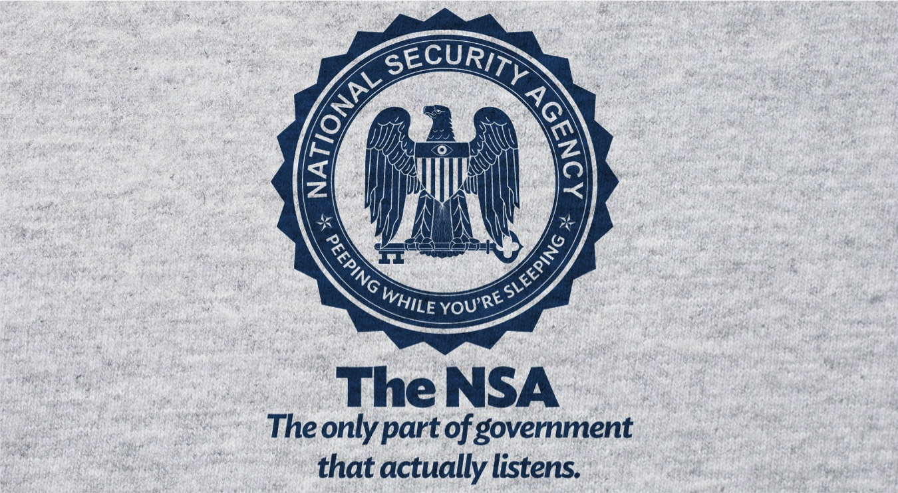

# Motivation (2)

Please note:

  * the leaks also revealed to non-democratic countries precise recipies on how to do country wide or even Internet-wide surveillance, traffic inspection and -modification, etc.
  * If politicians in other countries did not know how to do this, now they know!
  * If criminals did not know how to do this, now they know!

# The reaction

\centering { \textbf{Don't give them anything for free}\par
  It's your home, you fight! }

# The reaction (2)

  * We as humans are used to certain **modes** in communications:
spoken words tend to:
    * be forgotten over time ("data expires")
    * get modified/changed whenever "copied" (repeated)
    * get changed/modified over time  ("forgetfullness")
    * we tend to be not so harsh about them ("forgive")
    * have a limited geographic range ("town talk")
    * be very decentralized ("accoustic range")
  * digital traces/data tends to be:
    * stored for ever. Never modified by default
    * used against you in the future
    * very centralized
    * copied very easily
    * always searchable in O(log(n)) 
    
  
# The reaction (3)

\centering { \textbf{Crypto is the only thing that might still help}
\par
a.k.a.:\par
	``\textit{The Bottom Line Is That Encryption Does Work}'', Edward Snowden
}

# But where?

  * Ca. August 2013: Adi Kriegisch asks Aaron Kaplan where he could find good recommendations on SSL settings.
  * Does that exist? At that time:
    - no ssllabs cookbook
    - only theoretical recommendations (ENISA, eCrypt II, NIST)
    - ioerror's duraconf settings are outdated
    - no practical copy & paste-able settings exist?

# Project plan

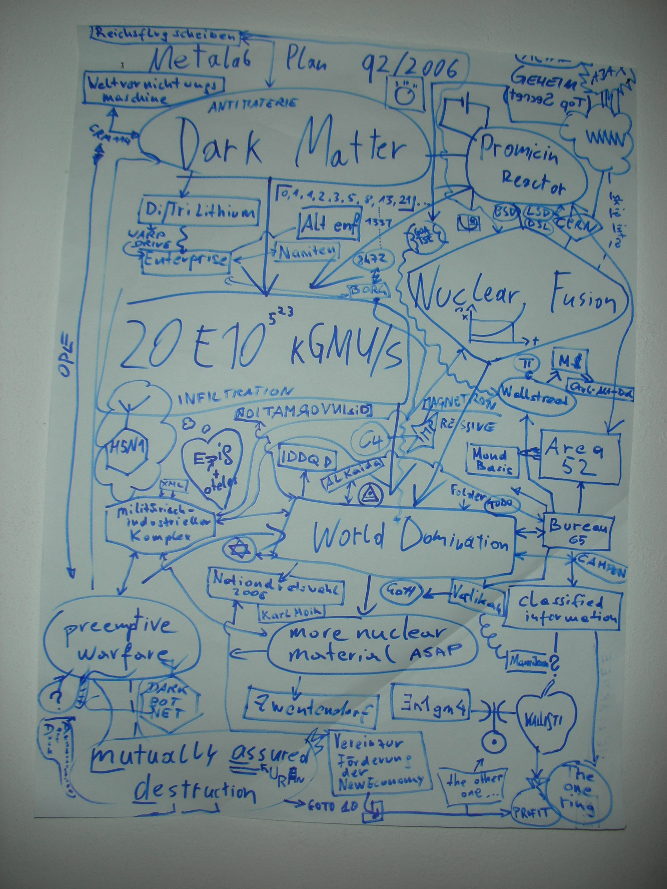

# Project plan  (srsly)

  * Do at least something against the **Cryptocalypse**
  * Check SSL, SSH, PGP crypto SeIngs in the most common services and certificates:
    –  Apache, Nginx, lighthNp
	–  IMAP/POP servers (dovecot, cyrus, ...) –  openssl.conf
	–  Etc.
  * Write down our experinces as guide
  * Create easy, copy & paste-able settings which are "OK" (as far as we know) for sysadmins.
  * Keep the guide short. There are many good recommendations out there written by cryptographers for cryptographers
  * Many eyes must check this!
  * Make it open source

  

# Why is this relevant for you?

  * You run networks and services. These are targets. If you believe it or not.
  * You produce code. Make sure it uses good crypto coding practices

  * However good crypto is hard to achieve
  * Crypto does not solve all problems, but it helps

# Who?

Wolfgang Breyha (uni VIE), David Durvaux, Tobias Dussa (KIT-CERT), L. Aaron Kaplan (CERT.at), Christian Mock (coretec), Daniel Kovacic (A-Trust), Manuel Koschuch (FH Campus Wien), Adi Kriegisch (VRVis), Ramin Sabet (A-Trust), Aaron Zauner (azet.org), Pepi Zawodsky (maclemon.at), IAIK, A-Sit, ...  

# Contents so far

  * Intro
  * Disclaimer 
  * Methods 
  * Theory
    * Elliptic Curve Cryptography 
    * Keylengths 
    * Random Number Generators 
    * Cipher suites – general overview & how to choose one
  * Recommendations on practical settings 
  * Tools 
  * Links 
  * Appendix

# Methods and Principles

C.O.S.H.E.R principle:
  * **C**ompletely
  * **O**pen 
  * **S**ource
  * **H**eaders
  * **E**ngineering and
  * **R**esearch

Methods:
  * Public review
  * commits get **discussed**
  * recommendations **need** references (like wikipedia)
  * Every commit gets logged & we need your review!

# How to commit

  * https://git.bettercrypto.org (master, read-only)
  * https://github.com/BetterCrypto/ (please clone this one & send PRs)

How?
  1. discuss the changes first on the mailinglist
  2. clone 
  3. follow the templates 
  3. send pull requests
  3. **split the commit into many smaller commits **
  4. don't be cross if something does not get accepted. 
  5. be ready for discussion
 
# History part

Pre-history
  * Scytale (7h century BC)
  * Caesar 
  * Vigenère (in a cifra del. Sig. Giovan Battista Bellaso, 1533)

# How you can loose your head
  * Mary Queen of Scots (1542 - 1587)
    * Queen of Scotland until 1567
    * Try to regain the throne 
    * Was found guilty of plotting to assassinate Queen Elizabeth I of England
    * Prooven after his code get broken...

# How it can change a war
  * II World War
    * Enigma in use by German Army
    * Broken by the first comuter (Alan Turing)
    * Sign the end of U-Boat supremacy on the sea

# A sort of Steganography 
  * Navajos Code Talkers (Pacific War - US Navy)

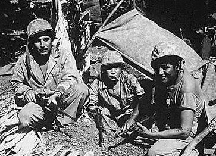

# Nowadays
  * Asymetric cryptography
    * RSA (River - Shamir - Adleman) - 1977
    * GPG (Phil Zimmerman) - 1991
  * AES (Rijdael) - 1998

# Famous names
  * Cryptography was an hot topic for a lot of people
    * Thomas Jefferson (1790) - ciphering cylinder (used for 150 years)
    * Charles Babbage - break the Vigenère Cipher (1854, unknown until 20th Century)
    * Gilbert S. Vernam (AT&T, 1917) - polyalphatic cipher with random key without repetition
      * Only ciphersuite impossible to break both in theory and in practice!

# Theory 

\[
 \hbar \frac{\partial}{\partial t}\Psi = \hat H \Psi
\]

# Some thoughts on ECC

  * Currently this is under heavy debate
  * Trust the Math
    * eg. NIST P-256 (http://safecurves.cr.yp.to/rigid.html)
    * Coefficients generated by hashing the unexplained seed c49d3608 86e70493 6a6678e1 139d26b7 819f7e90.
  * Might have to change settings tomorrow
  * Most Applications only work with NIST-Curves
  * Bottom line: we leave the choice of ECC yes or no to the reader. You might have to adapt again.
  * However, many server operators tend towards ECC  (speed)

# Keylengths

  * http://www.keylength.com/ 
  * Recommended Keylengths, Hashing algorithms, etc.
  * Currently:
    * RSA: >= 3248 bits (Ecrypt II)	
    * ECC: >= 256	
    * SHA 2+ (SHA 256,…)
    * AES 128 is good enough

# AES 128? Is that enough?

\centering{,,On the choice between AES256 and AES128: I would never consider using AES256, just like I don’t wear a helmet when I sit inside my car. It’s too much bother for the epsilon improvement in security.''\par
— Vincent Rijmen in a personal mail exchange Dec 2013
}
  * Some theoretical attacks on AES-256

# (Perfect) Forward Secrecy

Motivation:

* Three letter agency (TLA) stores all ssl traffic
* Someday TLA gains access to ssl-private key (Brute Force, Physical Force)
* TLA can decrypt all stored traffic

Solution:
* **Ephemeral** session keys via Diffie Hellman (**DHE**)

# Review of Diffie Hellman

Let g be a primitive root mod p. p is a Prime.

Alice to Bob: \[ X = g^x \mod p  \]
Bob to Alice:  \[ Y = g^y \mod p  \]
Alice calculates: \[  k_1 = Y^x \mod p \]
Bob calculates:   \[ k_2 = X^y \mod p .  \text{. Therefore, } k_1 = k_2 \]
Proof: \[ k_1 = Y^x = (g^y)^x = g^{(x*y)} = (g^x)^y = X^y = k_2  \mod p \qed \]

# Reality 

\centerline{\includegraphics[width=12cm]{img/xkcd-TLA.png}}

# Well...

We still recommend perfect forward secrecy.

 * Ephemeral: new key for each execution of a key exchange process
 * SSL private-Key only for authentication
 * Alternative new ssl private key every x days months
 * Pro:
    - Highest Security against future attacks
 * Contra: 
    - Elliptic Curve
    - Processing costs

# (P)RNGs

  * (P)RNGs **are** important!
  * Nadia Heninger et al / Lenstra et al
,,… to identify apparently vulnerable devices from 27 manufacturers.''
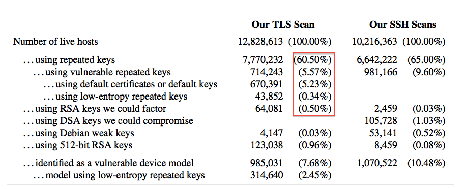
  * Entropy after startup: embedded devices quite bad

# (P)RNGs - recommendations
  * Look out for known weak RNG
    * Dual EC_DRBG is weak (slow, used in RSA-toolkit)
    * Intel RNG ? Recommendation: add System-Entropy (Network). Entropy only goes up.
  * Use tools (e.g. haveged/HaveGE http://dl.acm.org/citation.cfm?id=945516)
  * RTFM 
    * when is the router key generated
    * Default Keys ?
  * Re-generate keys from time to time

# Cipher suites

  * What is a SSLCipherSuite?
  * vs. SSLProtocol

  * Example:

	SSLProtocol All -SSLv2 -SSLv3
	SSLCipherSuite 'EDH+CAMELLIA:EDH+aRSA:EECDH+aRSA+AESGCM:EECDH+aRSA+SHA384:EECDH+aRSA+SHA256:EECDH:+CAMELLIA256:+AES256:+CAMELLIA128:+AES128:+SSLv3:!aNULL:!eNULL:!LOW:!3DES:!MD5:!EXP:!PSK:!DSS:!RC4:!SEED:!ECDSA:CAMELLIA256-SHA:AES256-SHA:CAMELLIA128-SHA:AES128-SHA'

# Some general thoughts on settings

  * General:
    * Disable SSL 2.0 (weak algorithms)
    * Disable SSL 3.0 (BEAST vs IE/XP)
    * Enable TLS 1.0 or better
    * Disable TLS-Compression (SSL-CRIME Attack)
    * Implement HSTS (HTTP Strict Transport Security)
  * Variant A: fewer supported clients
  * Variant B: more clients, weaker settings

# Variant **A**

    EECDH+aRSA+AES256:EDH+aRSA+AES256:!SSLv3

Compatibility: 

Only clients which support TLS1.2 are covered by these cipher suites (Chrome 30, Win 7 and Win 8.1, Opera 17, OpenSSL >= 1.0.1e, Safari 6 / iOS 6.0.1, Safari 7 / OS X 10.9) 

# Variant **B**

  * weaker ciphers, many clients 

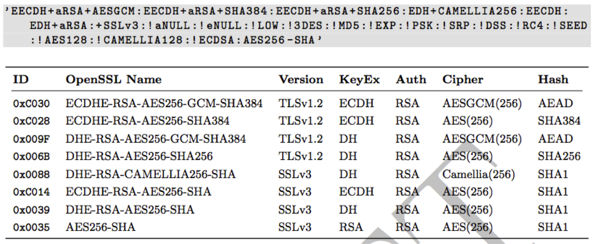

# Variant B compatibility

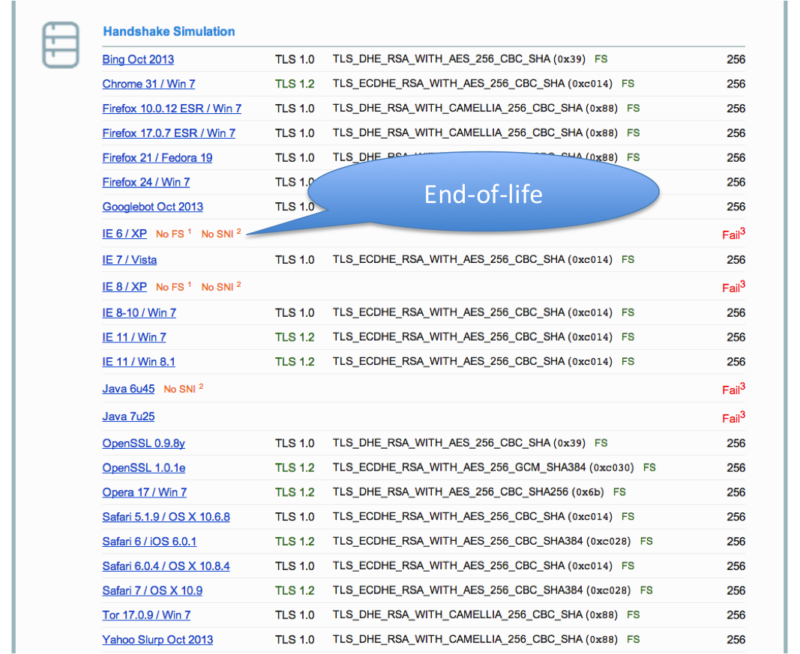

# Choosing your own CipherSuite string

  * Rolling your own cipher suite string involves a trade-off between:
    * Compatibility (server <-> client), vs.
    * Known weak ciphers/hashes/MACs
    * The choice ECC or not, vs.
    * Support by different ssl libs (gnutls, openssl,...) vs.
    * Different versions of ssl libs
  * In case of ssl lib version issues: do you want to re-compile the whole server for a newer version?
  * Be aware of these issues before choosing your own cipher suite. Have test suites!

# Choosing your own CipherSuite string (2)

  * Complexity 
  * It is a multi-dimensional optimisation problem
  * Consider strong alternativesto de-facto standards (pros/cons - CAMELLIA vs. AES)
  * _WISHLIST_: generator for settings? click-dropdown boxes on the webserver -> gernate config
  * _WISHLIST_: right now we only support OpenSSL CipherSuite names/configs. What about gnutls, etc.?

# Practical settings

# What we have so far

* Web server: Apache, nginx, MS IIS, lighttpd
* Mail: Dovecot, cyrus, Postfix, Exim
* DBs: Mysql, Oracle, Postgresql, DB2
* VPN: OpenVPN, IPSec, Checkpoint, ...
* Proxies: Squid, Pound
* GnuPG
* SSH
* IM servers (jabber, irc)
* _DANE_
* _Configuration code snippets_

# What are we missing

_WISHLIST_:

  * Section on generating CSRs (\texttt{-sha256} etc)
  * Mail: Exchange, Sendmail
  * SIP
  * RDP

  * Everything as HTML (easier to copy & paste)
  * gnutls setttings
  * Config generator on the website
  * Automatic testing suite

# Example Apache

  * Selecting cipher suites:

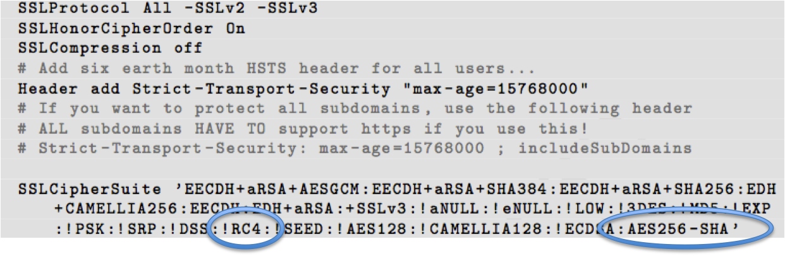

  * Additionally mod\_rewrite:

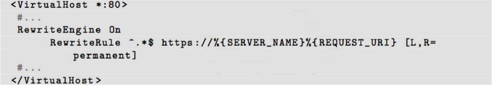

# Testing

# How to test - Tools

  * openssl s_client  (or gnutls-cli)
  * **ssllabs.com**: checks for servers as well as clients
  * xmpp.net
  * sslscan
  * SSLyze

# Tools: openssl s_client

   openssl s_client -showcerts –connect git.bettercrypto.org:443

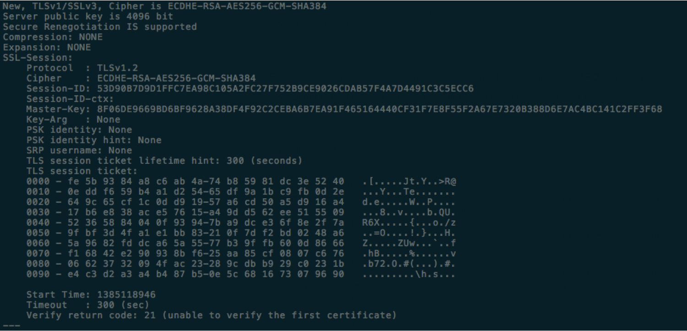

# Tools: sslscan

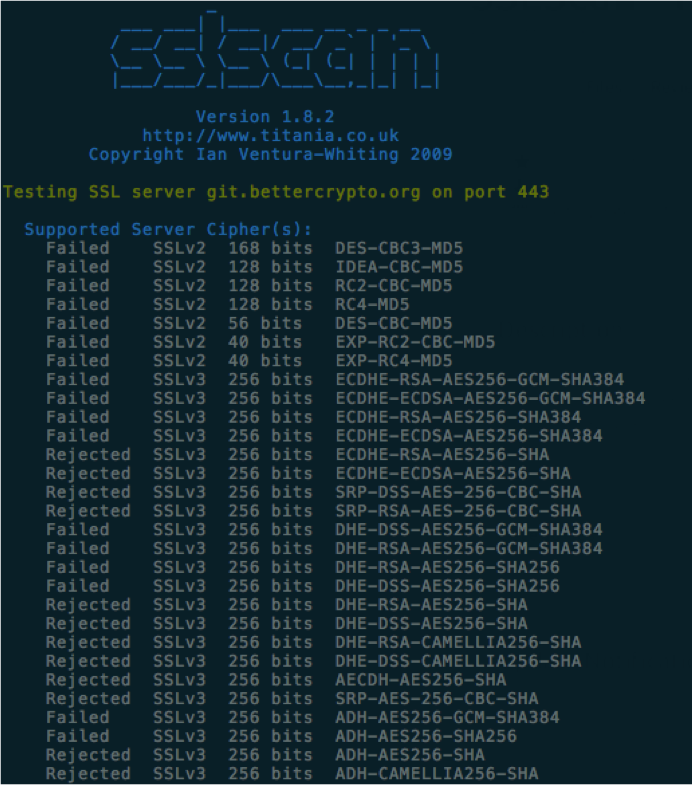

# Tools: ssllabs.com

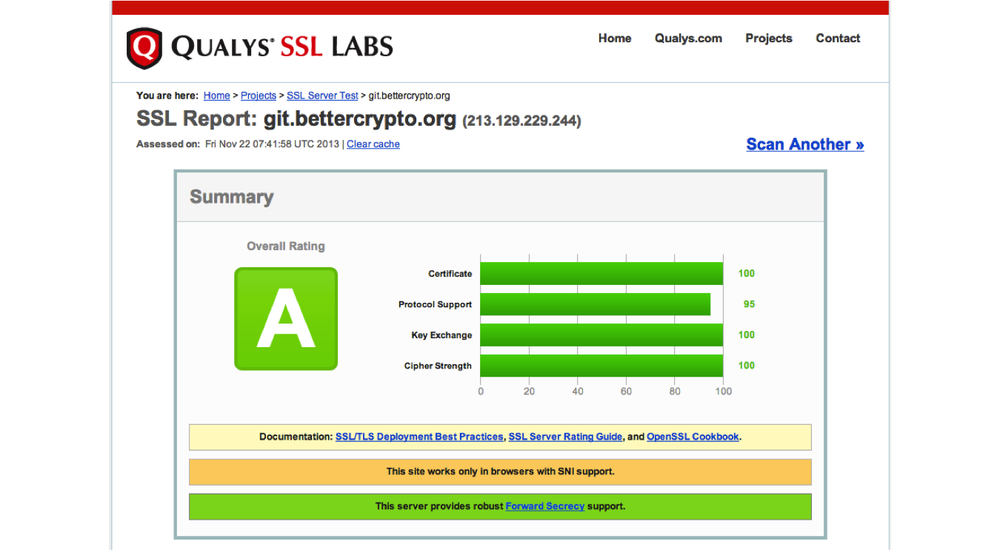

# Tools: sslllabs.com (2)

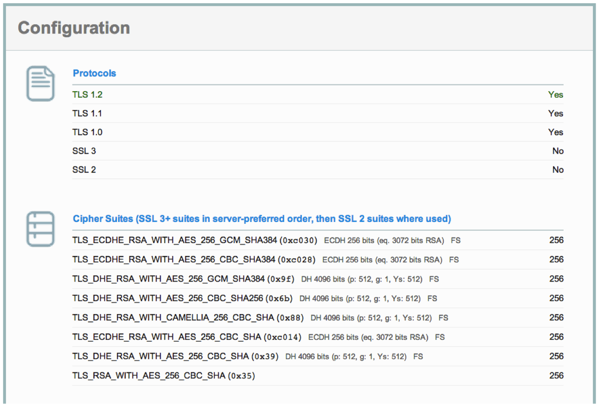

# Tools: sslllabs.com (3)

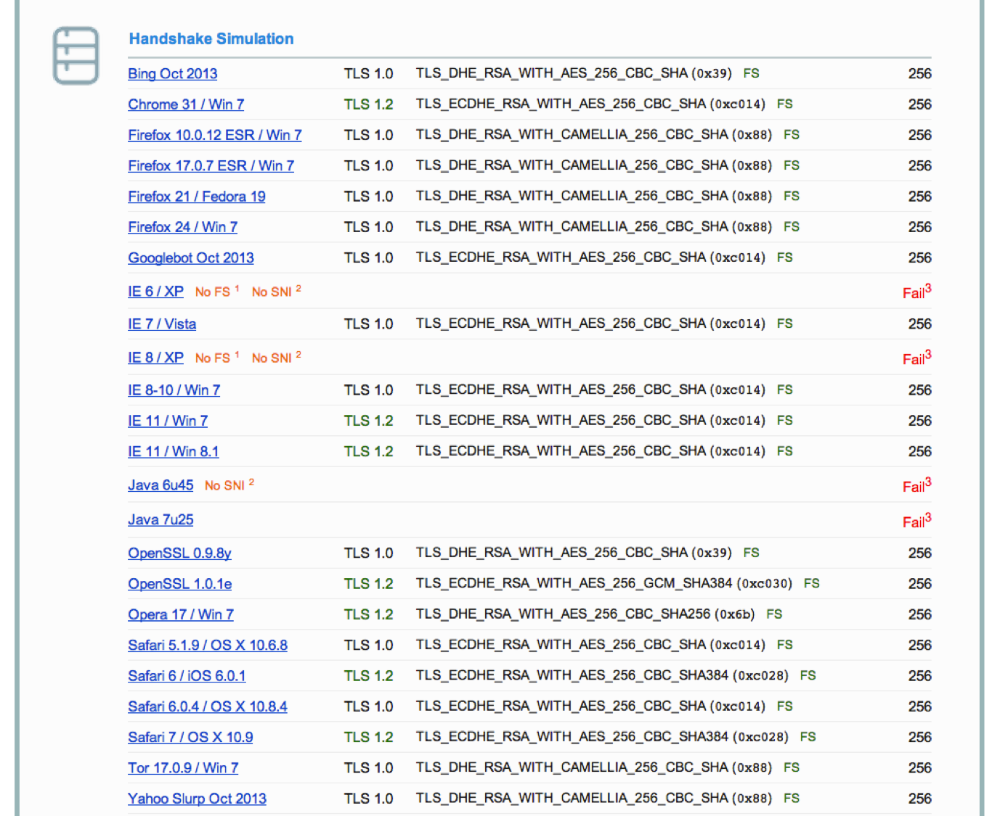

# /End of Part 1

# Begin Part 2: Attacks, current topics, reactions from the Internet community

-> azet

# Wrap-up

# Current state as of 2014/10/06

  * OK: More or less solid basis with Variant (A) and (B)
( Some minor modifications needed - maybe)
  * Public draft was presented at the CCC Dec 2013. 
Well received. Good feedback (Dan Bernstein, ...)

# What's still needed?

  * Need to convert to HTML/restructured text (RST) and have the whole guide on the web
  * fix the \texttt{@@@CIPHERSTRINGB@@@} macro in the configuration/ dir
  * re-review  the configuration/\* files. Maybe crap slipped in 
due to large commits :(
  * _WISHLIST_: config generator
  * _WISHLIST_: automatic compatibility testing
  * _WISHLIST_: automatic internet-wide measurement (massscan, zmap, ...)
  * long term maintenance / upkeep strategy

# How to participate?

1. We need: cryptologists, sysadmins, hackers
1. Read the document, find bugs!
1. Master git repo (git.bettercrypto.org) is world-readable. 
1. Subscribe to the mailing list
1. look at the TODO.md file
1. Understand the cipher strings Variant (A) and (B) before proposing some changes

# How to participate? (2)
1. If you add content to a subsection, make a sample config with variant (B)
1. **use the \texttt{@@@CIPHERSTRINGB@@@} macro !** :
  * edit config snippets in \texttt{configuration/\*}
  * \texttt{make config} to copy over the template from \texttt{configuration/} to \texttt{stage/}
  * \texttt{make config} basically does: \texttt{sed -i "s/@@@CIPHERSTRINGB@@@/\$cipherstringB/g"}
1. Use the github.com repo for pull requests
1. **important:** please do many smaller commits! It's easier to review and merge.

# How to participate? (3)
We need: 
  * Add content to an subsection from the TODO list -> send us diffs
  * Reviewers!

Accept that  your commit might be under quite some scrutiny, that's the game.
  * **C**ompletely
  * **O**pen
  * **S**ource
  * **H**eaders
  * **E**ngineering and
  * **R**esearch

# Links

  * Website: www.bettercrypto.org
  * Master (read-only) Git repo: https://git.bettercrypto.org
  * Public github repo for PRs: https://github.com/BetterCrypto/Applied-Crypto-Hardening
  * Mailing list: http://lists.cert.at/cgi-bin/mailman/listinfo/ach 
  * IRC: #bettercrypto on freenode

# Thanks

\centerline{Thanks}

