% Bettercrypto - Applied Crypto Hardening for Sysadmins
% L. Aaron Kaplan <kaplan@cert.at> ;\vspace{\baselineskip} Pepi Zawodsky <pepi.zawodsky@maclemon.at>
% 2015-03-30
---------------------------

# Part 1:  Intro to the project

---
# Overview 

  1. **Part 1:** Intro to bettercrypto & Motivation
  2. How we got started, how we work, what's there, what's missing, how to use the guide
  2. Brainstorming round: what's needed for the organisation?
  3. **Part 2:** Background
  3. History of Crypto in a nutshell
  4. Theory
  4. 12:30 __lunch break__
  5. Theory (cont.)
  5. Practical settings
  6. **Part 3:** Testing, tools, finding a process for improvement
  6. Brainstorming round: finding an internal testing strategy
  7. wrap up & next steps
    

# Prerequisites

  * Participants should have a basic knowledge of System administration and be familiar with configuring Apache, nginx, etc.
  * know git/github
  * a basic knowledge of cryptography will help.

# Motivation

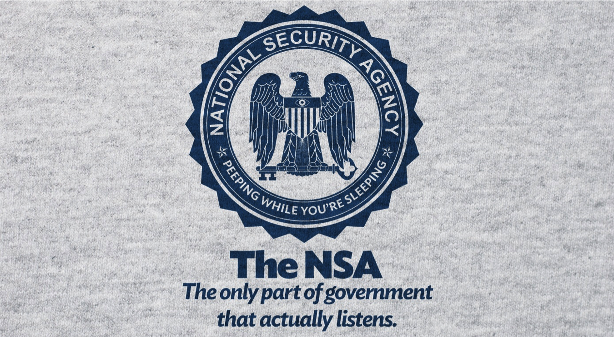

# Motivation (2)

Please note:

  * the leaks also revealed to all countries worldwide precise recipies on how to do country wide or even Internet-wide surveillance, traffic inspection and -modification, etc.
  * If politicians in other countries did not know how to do this, now they know!
  * If criminals did not know how to do this, now they know!

# Motivation (3)
\begin{flushright}
\includegraphics[width=3cm]{img/Klaus_Landefeld.jpg}
\end{flushright}

Ende-zu-Ende-Verschlüsselung ist das Einzige, das funktioniert. Leitungen verschlüsseln ist auch schwierig, es gibt keine Standards. Und das Problem mit ausländischen Anbietern bleibt. Bereits beim Endkunden verschlüsseln, alles andere wird nicht helfen.  
	 \begin{flushright}
— Klaus Landefeld, Beirat DE-CIX Management GmbH
2015-03-26, NSA Untersuchungssausschuß im deutschen Bundestag
	 \end{flushright}

# The reaction

\centering { \textbf{Don't give them anything for free}\par
  It's your home, you fight! }

# The reaction (2)

  * We as humans are used to certain **modes** in communications:
spoken words tend to:
    * be forgotten over time ("data expires")
    * get modified/changed whenever "copied" (repeated)
    * get changed/modified over time  ("forgetfullness")
    * we tend to be not so harsh about them ("forgive")
    * have a limited geographic range ("town talk")
    * be very decentralized ("accoustic range")
  * digital traces/data tends to be:
    * stored for ever. Never modified by default
    * used against you in the future
    * very centralized
    * copied very easily
    * always searchable in O(log(n)) 
    
  
# The reaction (3)

\centering { \textbf{Crypto is the only thing that might still help}
\par
a.k.a.:\par
	``\textit{The Bottom Line Is That Encryption Does Work}'' 
	 \begin{flushright}
	 — Edward Snowden
	 \end{flushright}
}

# But where?

  * Ca. August 2013: Adi Kriegisch asks Aaron Kaplan where he could find good recommendations on SSL settings.
  * Does that exist? At that time:
    - no ssllabs cookbook
    - only theoretical recommendations (ENISA, eCrypt II, NIST)
    - ioerror's duraconf settings are outdated
    - no practical copy & paste-able settings exist?

# Project plan

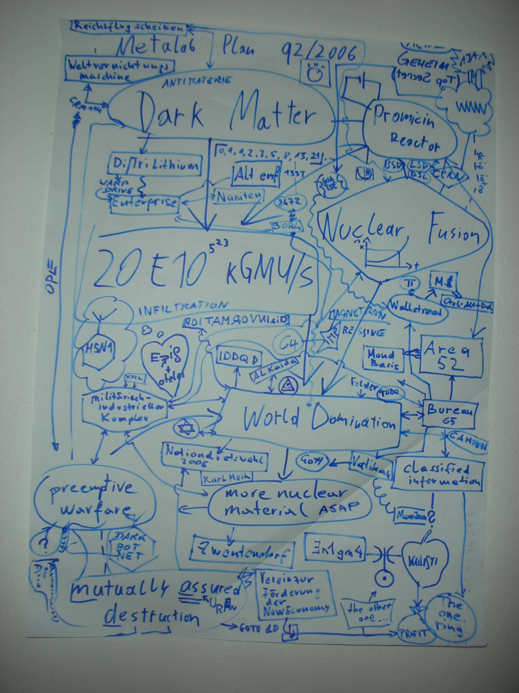

# Project plan  (srsly)

  * Do at least something against the **Cryptocalypse**
  * Check SSL, SSH, PGP crypto Settings in the most common services and certificates:
    –  Apache, nginx, lighttpd
	–  IMAP/POP servers (dovecot, cyrus, …) –  openssl.conf
	–  Etc.
  * Write down our experiences as guide
  * Create easy, copy & paste-able settings which are "OK" (as far as we know) for sysadmins.
  * Keep the guide short. There are many good recommendations out there written by cryptographers for cryptographers
  * Many eyes must check this!
  * Make it open source

# Why is this relevant for you?

  * You run networks and services. These are targets. If you believe it or not.
  * You produce code. Make sure it uses good crypto coding practices

  * However good crypto is hard to achieve
  * Crypto does not solve all problems, but it helps
  * There are no secure defaults

# Who?

Wolfgang Breyha (uni VIE), David Durvaux, Tobias Dussa (KIT-CERT), L. Aaron Kaplan (CERT.at), Christian Mock (coretec), Daniel Kovacic (A-Trust), Manuel Koschuch (FH Campus Wien), Adi Kriegisch (VRVis), Ramin Sabet (A-Trust), Aaron Zauner (azet.org), Pepi Zawodsky (maclemon.at), IAIK, A-Sit, and many more…  

# Contents so far

  * Intro
  * Disclaimer 
  * Methods 
  * Theory
    * Elliptic Curve Cryptography 
    * Keylengths 
    * Random Number Generators 
    * Cipher suites – general overview & how to choose one
  * Recommendations on practical settings 
  * Tools 
  * Links 
  * Appendix

# Methods and Principles

C.O.S.H.E.R principle:
  * **C**ompletely
  * **O**pen 
  * **S**ource
  * **H**eaders
  * **E**ngineering and
  * **R**esearch

Methods:
  * Public review
  * commits get **discussed**
  * recommendations **need** references (like wikipedia)
  * Every commit gets logged & we need your review!

# How to commit

  * https://git.bettercrypto.org (master, read-only)
  * https://github.com/BetterCrypto/ (please clone this one & send PRs)

How?
  1. discuss the changes first on the mailinglist
  2. clone 
  3. follow the templates 
  3. send pull requests
  3. **split the commit into many smaller commits **
  4. don't be cross if something does not get accepted. 
  5. be ready for discussion
 

# Feedback from professional cryptographers

  * multiple times mentioned in talks by Dan J. Bernstein & Tanja Lange
(ONE Conference, CCC, ...)
  * good initial feedback from Vincent Rijmen (inventor of AES)
  * got invited to the IETF STRINT workshop 2014

# Part 2 

\centering { \textbf{A large organisation has its own needs} }

(Taking notes on infrastructure, legacy systems, inventory, etc.)

# Brainstorming: what's needed in your organisation? 
(interactive session)

Some points to get us thinking:
  * What are the issues you have encounted with running more crypto?
  * Which legacy systems exist? Can they be updated ? 
  * How can you test all of your systems if they use strong crypto?
  * Is there an inventory of all services and servers?
  * Which services can be tested from outside? 
  * Which only from inside? 
  * Which interfaces exist to outside organisations using crypto? 
  * ..... interfaces to ... , which should use crypto?

# What's needed in your organisation? (2)
(continued) 
  * Are there any protection rings / classifications on different sets of information?
  * Are there any automatic processes using SSL/crypto which can get disturbed by 
updates?
  * How to test these processes if they work?
  * ***Key-roll-overs***: are there procedures for this? What happens when upgrading to 4k?
  * Do not underestimate the amount of work for key-management

# Proposed meta-strategy
  * practice key-roll-overs
  * practice identifying all services which run crypto
  * practice testing them against known good standards automatically (nagios, ...)
  * practive crypto config changes
 
Turns out, key management as well as crypto management can be seen similarly to regular patch management: it needs periodic attention.

# Part 3

\centering { \textbf{History, Theory}}

# History part

Pre-history
  * Scytale (7h century BC)
  * Caesar 
  * Vigenère (in a cifra del. Sig. Giovan Battista Bellaso, 1533)

# How you can loose your head
  * Mary Queen of Scots (1542 - 1587)
    * Queen of Scotland until 1567
    * Try to regain the throne 
    * Was found guilty of plotting to assassinate Queen Elizabeth I of England
    * Proven after her code get broken…

# How it can change a war
  * World War II
    * Enigma in use by German Army
    * Broken by the first computer (Alan Turing)
    * Sign the end of U-Boat supremacy on the sea

# A sort of Steganography 
  * Navajos Code Talkers (Pacific War - US Navy)

# Nowadays
  * Asymmetric cryptography
    * RSA (Rivest - Shamir - Adleman) - 1977
    * GPG (Phil Zimmerman) - 1991
  * AES (Rijndael) - 1998

# Famous names
  * Cryptography was an hot topic for a lot of people
    * Thomas Jefferson (1790) - ciphering cylinder (used for 150 years)
    * Charles Babbage - break the Vigenère Cipher (1854, unknown until 20th Century)
    * Gilbert S. Vernam (AT&T, 1917) - polyalphabetic cipher with random key without repetition
      * Only cipher suite impossible to break both in theory and in practice!

# Theory 

\[
 \hbar \frac{\partial}{\partial t}\Psi = \hat H \Psi
\]

# Some thoughts on ECC

  * Currently this is under heavy debate
  * Trust the Math
    * eg. NIST P-256 (http://safecurves.cr.yp.to/rigid.html)
    * Coefficients generated by hashing the unexplained seed c49d3608 86e70493 6a6678e1 139d26b7 819f7e90.
  * Might have to change settings tomorrow
  * Most Applications only work with NIST-Curves
  * Bottom line: we leave the choice of ECC yes or no to the reader. You might have to adapt again.
  * However, many server operators tend towards ECC for speed

# Keylengths

  * http://www.keylength.com/ 
  * Recommended Keylengths, Hashing algorithms, etc.
  * Currently:
    * RSA: >= 3248 bits (Ecrypt II)	
    * ECC: >= 256	
    * SHA 2+ (SHA 256,…)
    * AES 128 is good enough

# AES 128? Is that enough?

\centering{,,On the choice between AES256 and AES128: I would never consider using AES256, just like I don’t wear a helmet when I sit inside my car. It’s too much bother for the epsilon improvement in security.''\par
— Vincent Rijmen in a personal mail exchange Dec 2013
}
  * Some theoretical attacks on AES-256

# (Perfect) Forward Secrecy

Problem:
* Three letter agency (TLA) records all encrypted traffic
* Someday TLA gains access to private-key (Brute Force, Physical Force)
* TLA can decrypt all recorded traffic

Solution:
* **Ephemeral** session keys via Diffie Hellman (**DHE**)

# Review of Diffie Hellman

Let g be a primitive root mod p. p is a Prime.

Alice to Bob: \[ X = g^x \mod p  \]
Bob to Alice:  \[ Y = g^y \mod p  \]
Alice calculates: \[  k_1 = Y^x \mod p \]
Bob calculates:   \[ k_2 = X^y \mod p .  \text{. Therefore, } k_1 = k_2 \]
Proof: \[ k_1 = Y^x = (g^y)^x = g^{(x \times y)} = (g^x)^y = X^y = k_2  \mod p \qed \]

# Reality 

\centerline{\includegraphics[width=10cm]{img/xkcd-TLA.png}}

# Well…

We recommend perfect forward secrecy.

 * Ephemeral: new key for each execution of a key exchange process
 * TLS private-key only for authentication
 * Alternative new private key every x days/months
 * Pro:
    - Highest security against future attacks
 * Contra: 
    - Elliptic Curves needed for broad client support
    - slight processing overhead

# (P)RNGs

  * (P)RNGs **are** important!
  * Nadia Heninger et al / Lenstra et al
“… to identify apparently vulnerable devices from 27 manufacturers.”
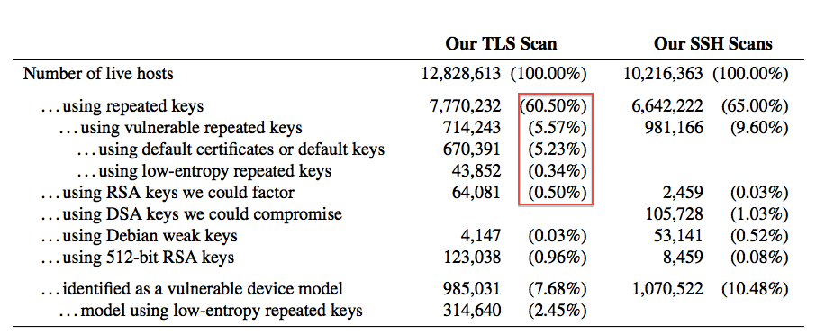
  * Entropy after startup: embedded devices and VMs very bad

# (P)RNGs - recommendations
  * Look out for known weak RNG
    * Dual EC_DRBG is weak (slow, used in RSA-toolkit)
    * Intel RNG ? Recommendation: add System-Entropy (Network). Entropy only increases.
  * Use tools (e.g. haveged/HaveGE http://dl.acm.org/citation.cfm?id=945516)
  * RTFM 
    * when is the router key generated
    * Default Keys?
  * Re-generate keys regularly
  * Do not generate keys on fresh VMs.
  * Always generate new keys when refreshing certificates

# Cipher suites

  * What is a SSLCipherSuite?
  * vs. SSLProtocol

  * Example:

	SSLProtocol All -SSLv2 -SSLv3
	SSLCipherSuite 'EDH+CAMELLIA:EDH+aRSA:EECDH+aRSA+AESGCM:EECDH+aRSA+SHA384:EECDH+aRSA+SHA256:EECDH:+CAMELLIA256:+AES256:+CAMELLIA128:+AES128:+SSLv3:!aNULL:!eNULL:!LOW:!3DES:!MD5:!EXP:!PSK:!DSS:!RC4:!SEED:!ECDSA:CAMELLIA256-SHA:AES256-SHA:CAMELLIA128-SHA:AES128-SHA'  
	
	Names are not consistent between official IANA strings and most libraries. They are easily mixed up, always double check.

# Some general thoughts on settings

  * General:
    * Disable SSL 2.0 (weak protocol and algorithms)
    * Disable SSL 3.0 (BEAST, POODLE)
    * [Disable RC4 cipher](https://www.ietf.org/rfc/rfc7465.txt) (RFC7465)
    * Disable EXPORT suites (FREAK Attack)
    * Enable TLS 1.0 or better
    * Disable TLS-Compression (SSL-CRIME Attack)
    * Implement HSTS (HTTP Strict Transport Security)
    * Implement OCSP stapling (Security and performance improvement)
  * Variant A: fewer supported clients
  * Variant B: more clients, weaker settings

  Attacks only get better.

# Variant **A**

    EECDH+aRSA+AES256:EDH+aRSA+AES256:!SSLv3

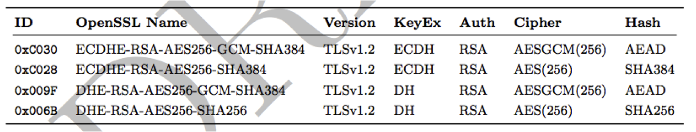

Compatibility: 

Only clients which support TLS1.2 are covered by these cipher suites (Chrome 30, Win 7 and Win 8.1, Opera 17, OpenSSL >= 1.0.1e, Safari 6/iOS 5, Safari 7/OS X 10.9)
Excellent for controlled environments, like intranet.

# Variant **B**

  * weaker ciphers, broad client support

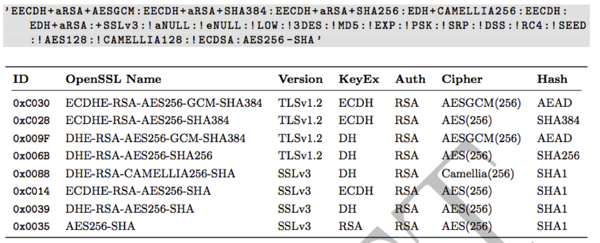

# Variant B compatibility

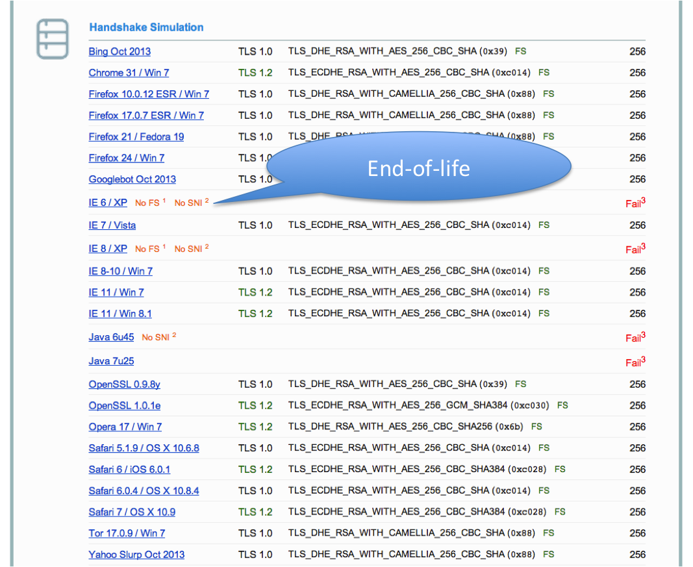

# Choosing your own CipherSuite string

  * Rolling your own cipher suite string involves a trade-off between:
    * Compatibility (server <-> client), vs.
    * Known weak ciphers/hashes/MACs
    * The choice ECC or not, vs.
    * Support by different ssl libs (gnutls, openssl,...) vs.
    * Different versions of ssl libs
  * In case of ssl lib version issues: do you want to re-compile the whole server for a newer version?
  * Be aware of these issues before choosing your own cipher suite. Have test suites!

# Choosing your own CipherSuite string (2)

  * Complexity 
  * It is a multi-dimensional optimisation problem
  * Consider strong alternatives to de-facto standards (pros/cons - CAMELLIA vs. AES)
  * _WISHLIST_: generator for settings? click-dropdown boxes on the webserver -> generate config
  * _WISHLIST_: right now we only support OpenSSL CipherSuite names/configs. What about gnutls, etc.?

# Practical settings

# What we have so far

* Web server: Apache, nginx, MS IIS, lighttpd
* Mail: Dovecot, cyrus, Postfix, Exim
* DBs: Mysql, Oracle, Postgresql, DB2
* VPN: OpenVPN, IPSec, Checkpoint, …
* Proxies: Squid, Pound
* GnuPG
* SSH
* IM servers (jabber, irc)
* _DANE_ (this section is still WIP)
* _Configuration code snippets_

# What are we missing

_WISHLIST_:

  * Section on generating CSRs (\texttt{-sha256} etc)
  * Mail: Exchange, Sendmail
  * SIP
  * RDP

  * Everything as HTML/TXT (easier to copy & paste)
  * gnutls settings
  * Config generator on the website
  * Automatic testing suite

# Example Apache

  * Selecting cipher suites:

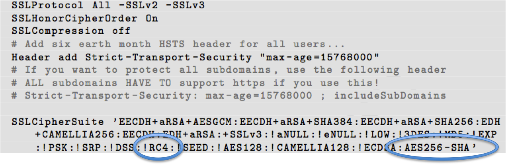

  * Additionally mod\_rewrite:

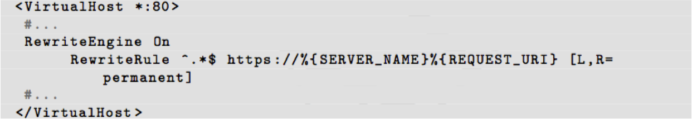

# Testing

# How to test - Tools

  * openssl s_client (or gnutls-cli)
  * **ssllabs.com**: checks for servers as well as clients
  * xmpp.net
  * sslscan: for internal scans
  * SSLyze: for internal scans
  * masscan: for internal scans
  * nmap: for internal scans

# Tools: openssl s_client

   openssl s_client -showcerts –connect git.bettercrypto.org:443

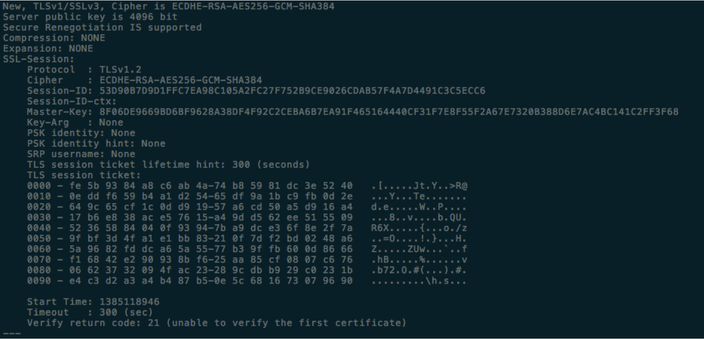

# Tools: sslscan

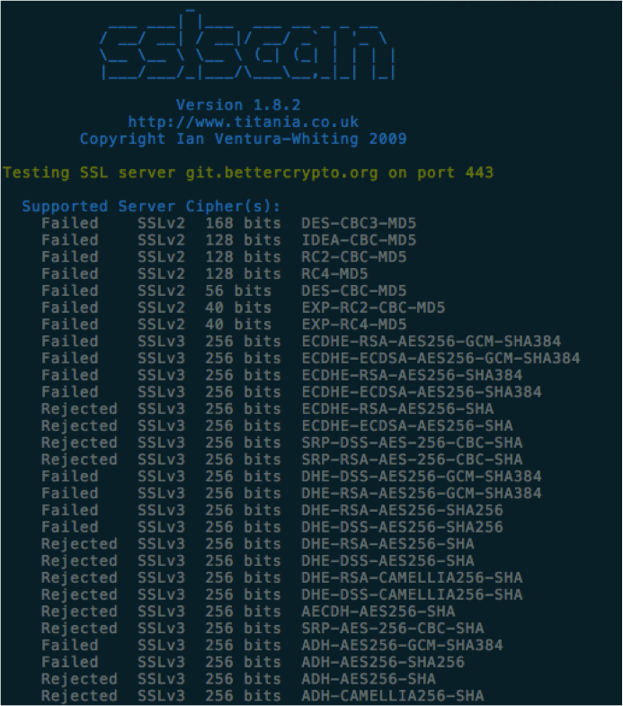

# Tools: ssllabs.com

# Tools: sslllabs.com (2)

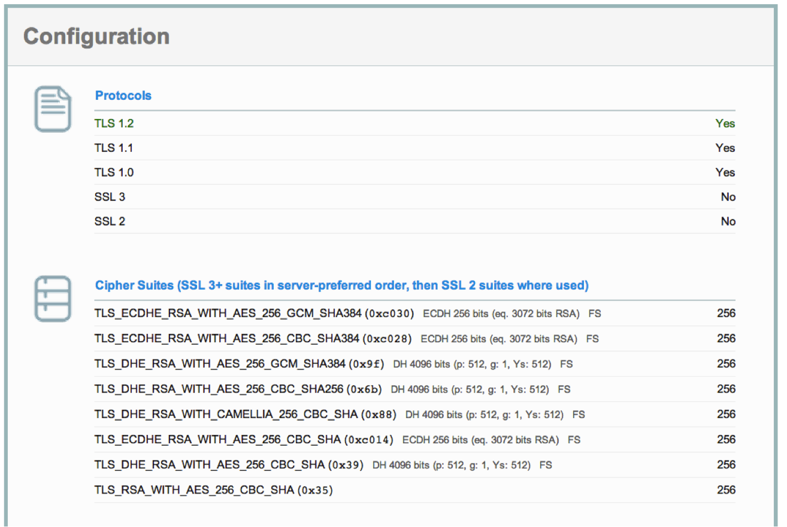

# Tools: sslllabs.com (3)

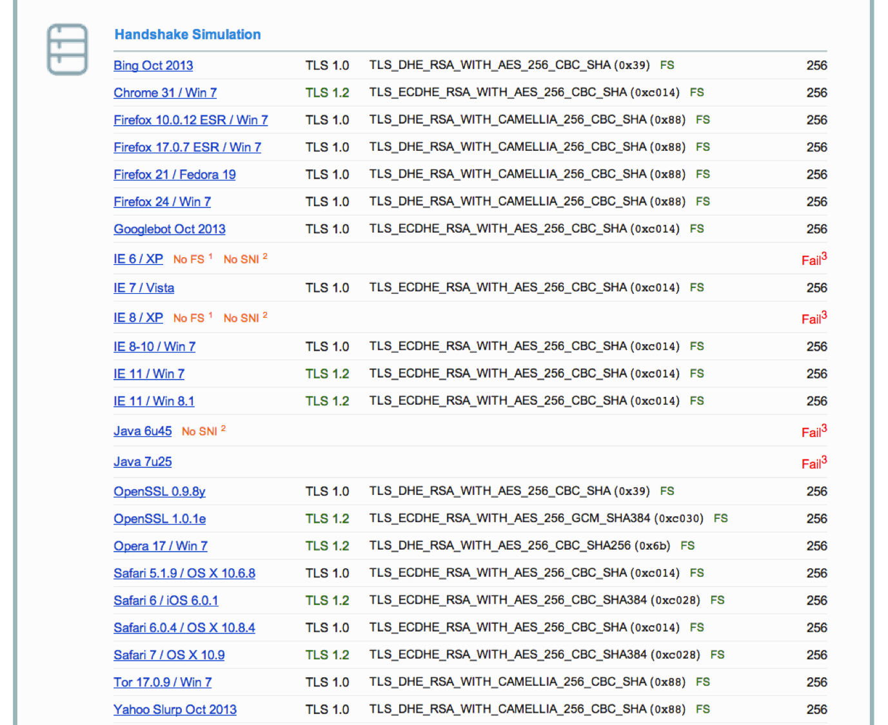

# Tools: masscan

[masscan](https://github.com/robertdavidgraham/masscan)

"TCP port scanner, spews SYN packets asynchronously, scanning entire Internet in under 5 minutes."

* Idea: if you have a very large network range, use masscan (***be sure to rate-limit!***) to discover all 
open ports 443, 993, 143, 25
* Now you have an inventory of SSL-speaking ports
* Use SSLyze to test these internally

# Tools: SSLyze

[SSLyze](https://github.com/nabla-c0d3/sslyze/releases) is a "Fast and full-featured SSL scanner"

A tool to test internally which cipher strings are supported.
The tool offers these features (amongst others):
  * get a list of targets (ip:port) from a file
  * XML output
  * heartbleed test
  * OCSP stapling test
  * SSLv2-TLS1.2 testing
  * finding preferred and supported cipher strings
  * STARTTLS testing (IMAP, pop, ...)
  * XMPP testing
  * SNI support
  * HSTS testing

# Tools: SSLyze (1)

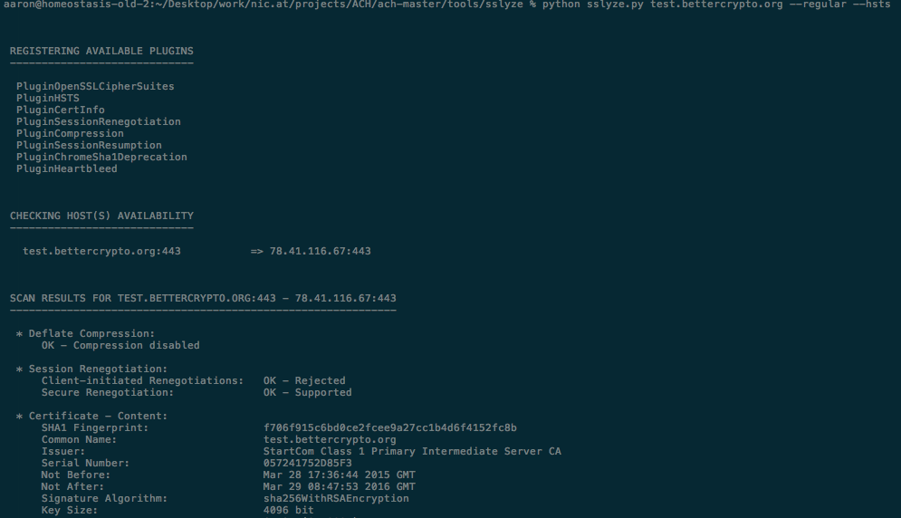

# Tools: SSLyze (2)

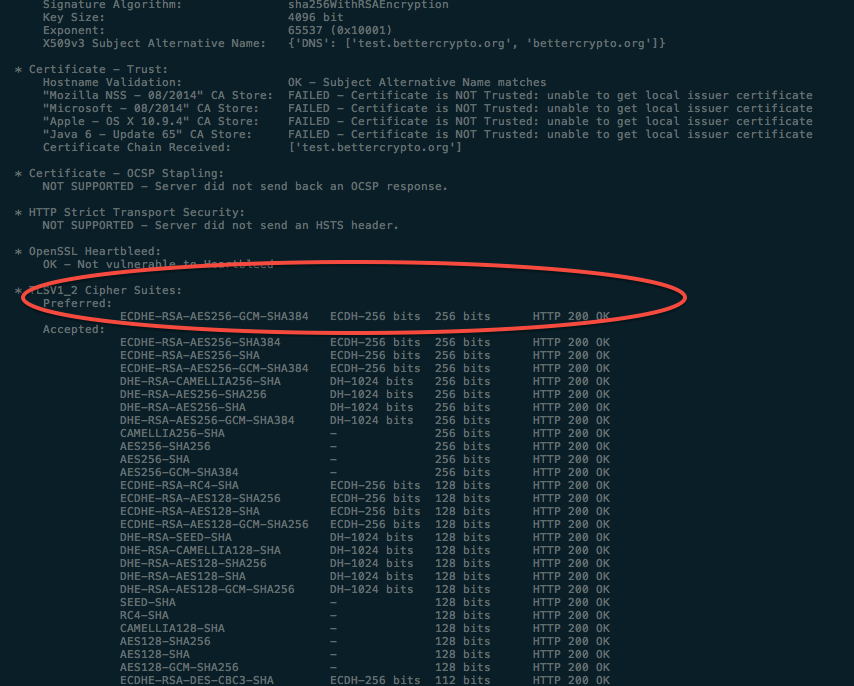

# Brainstorming: finding an internal testing strategy

Some questions to think about:
  * Which tests are non-intrusive? Which should be avoided?
  * Do we need a full inventory? Can we generate the inventory?
Does the inventory match the scanned results (hosts & ports)?
  * Should any  mismatch raise alarms?
  * Once we identified all IPs:ports - do we need to know hostnames? (SNI)?
  * Defining a common base-line level which MUST be supported
  * automatic testing against that base-line level? How?
  * Integration into existing monitoring solutions?

# Wrap-up

# Current state as of 2015-03-29

  * OK: Solid basis with Variant (A) and (B)
  * Public draft was presented at the CCC Dec 2013. 
Well received. Good feedback (Dan Bernstein, ...)
  * more work needs to be done:
   * certificate pinning
   * DANE
   * SPDY, HTTP/2
   * etc.
  * This is a process which should be done regularly

# Links

  * Website: https://www.bettercrypto.org
  * Master (read-only) Git repo: https://git.bettercrypto.org
  * Public github repo for PRs: https://github.com/BetterCrypto/Applied-Crypto-Hardening
  * Mailing list: http://lists.cert.at/cgi-bin/mailman/listinfo/ach 
  * IRC: #bettercrypto on freenode
  * Twitter: @bettercrypto

# Thanks

\centerline{Thanks}

