% BetterCrypto - three years in..
% TROOPERS16, Heidelberg, DE | 2016-03-17
% Aaron Zauner | @a_z_e_t | azet@azet.org
---------------------------

## Timeline
We start at the beginning. The year is 2013.

* June: Snowden revelations
* Summer: More leaks start appearing
* ... People start talking about a Crypto-Apocalypse (OMG!)
* August: Aaron Kaplan and Adi Kriegisch start discussing this
  topic/guide
* September/October: Project goes public, a lot of contributions and ML discussion

## Motivation

* Lack of available guides for sysadmins/mgmt for 'crypto hardening'
* No up-to-date blog posts we could make use of
* Crypto-guides (ENISA, eCrypto II, NIST etc.) for experts, not end-users/admins

## BetterCrypto
BetterCrypto(.org) - Applied Crypto Hardening is born

* Clear audience: sysadmins without expert knowledge (e.g. crypto),
  management, decision makers,..
* Clear target: explain all decisions, have open-mailing list
  discussion, everything FOSS, public and auditable

## BetterCrypto (cont.)
* Do at least something against the **Crypto-Apocalypse**
* Check SSL, SSH, PGP crypto settings in the most common services and
  certificates:
  –  Apache, Nginx, lighthttpd
      –  IMAP/POP servers (dovecot, cyrus, ...) –  openssl.conf
      –  Etc.
* Write down our experiences as guide
* Create easy, copy & paste-able settings which are "OK" (as far as we know) for sysadmins.
* Many eyes must check this!
* FOSS

## Why is this relevant for you?

* You run networks and services. These are targets. If you believe it or not.
* You produce code. Make sure it uses good crypto coding practices

* However good crypto is hard to achieve
* Crypto does not solve all problems, but it helps

## Who?

Wolfgang Breyha (uni VIE), David Durvaux, Tobias Dussa (KIT-CERT), L. Aaron Kaplan (CERT.at), Christian Mock (coretec), Daniel Kovacic (A-Trust), Manuel Koschuch (FH Campus Wien), Adi Kriegisch (VRVis), Ramin Sabet (A-Trust), Aaron Zauner (azet.org), Pepi Zawodsky (maclemon.at), IAIK, A-Sit, ...

* Sysadmins
* Engineers
* Devs.
* Cryptographers
* Security Engineers
* ...

## Contents.
About 100 pages. Rough Overview:

* Intro
* Disclaimer
* Methods
* Theory
  * Elliptic Curve Cryptography
  * Keylengths
  * Random Number Generators
  * Cipher suites – general overview & how to choose one
* Recommendations on practical settings
* Tools
* Links
* Appendix

## Methods and Principles

Methods:

* Public review
* commits get **discussed**
* recommendations **need** references (like wikipedia)
* Every commit gets logged & we need your review!

## How to contribute?

* https://git.bettercrypto.org (master, read-only)
* https://github.com/BetterCrypto/ (please clone this one & send PRs)

1. discuss the changes first on the mailinglist
2. clone
3. follow the templates
3. send pull requests
4. **split the commit into many smaller commits**
5. don't be cross if something does not get accepted.
6. be ready for discussion

## What do we provide?
* A common 'CipherString'
* Template configurations for *a lot* of different open source projects (also as textfiles)
* References, Crypto Background, Testing, Tools, etc,..

## What we have so far

* Web server: Apache, nginx, MS IIS, lighttpd
* Mail: Dovecot, cyrus, Postfix, Exim
* DBs: Mysql, Oracle, Postgresql, DB2
* VPN: OpenVPN, IPSec, Checkpoint, …
* Proxies: Squid, Pound
* GnuPG
* SSH
* IM servers (jabber, irc)
* _DANE_ (this section is still WIP)
* _Configuration code snippets_

## CipherString and Suite

In SSL/TLS terminology; a *ciphersuite* combines the previously mentioned cryptographic techniques to work together and forms part of a secure (online) communication protocol

  * Elliptic Curve Diffie-Hellman (Ephemeral - PFS)
  * RSA
  * AES128
  * Galois Counter Mode (GCM)
  * SHA256

* IANA standardized TLS parameters ``TLS_ECDHE_RSA_WITH_AES_128_GCM_SHA256``

differs between implementations (openssl, gnutls, cryptoapi etc.) and versions!

## (Perfect) Forward Secrecy

Problem:
* Three letter agency (TLA) records all encrypted traffic
* Someday TLA gains access to private-key (Brute Force, Physical Force)
* TLA can decrypt all recorded traffic

Solution:
* **Ephemeral** session keys via Diffie Hellman (**ECDHE** and **DHE**)

## Keylengths

  * http://www.keylength.com/
  * Recommended Keylengths, Hashing algorithms, etc.
  * Currently:
    * RSA: >= 3248 bits (Ecrypt II)
    * ECC: >= 256
    * SHA 2+ (SHA 256,…)
    * AES 128 is good enough

## AES 128? Is that enough?

\centering{,,On the choice between AES256 and AES128: I would never consider using AES256, just
like I don’t wear a helmet when I sit inside my car. It’s too much bother for the epsilon
improvement in security.''\par
— Vincent Rijmen in a personal mail exchange Dec 2013
}
  * Some theoretical attacks on AES-256

## CipherString and Suite

  * What is a SSLCipherSuite?
  * vs. SSLProtocol

  * Example:

        SSLProtocol All -SSLv2 -SSLv3
        SSLCipherSuite
'EDH+CAMELLIA:EDH+aRSA:EECDH+aRSA+AESGCM:
EECDH+aRSA+SHA384:EECDH+aRSA+SHA256:EECDH:
+CAMELLIA256:+AES256:+CAMELLIA128:+AES128:
+SSLv3:!aNULL:!eNULL:!LOW:!3DES:!MD5:!EXP:
!PSK:!DSS:!RC4:!SEED:!ECDSA:CAMELLIA256-SHA
:AES256-SHA:CAMELLIA128-SHA:AES128-SHA'

## CipherString and Suite

  * General:
    * Disable SSL 2.0 (weak protocol and algorithms)
    * Disable SSL 3.0 (BEAST, POODLE)
    * [Disable RC4 cipher](https://www.ietf.org/rfc/rfc7465.txt) (RFC7465)
    * Disable EXPORT suites (FREAK Attack)
    * Enable TLS 1.0 or better
    * Disable TLS-Compression (SSL-CRIME Attack)
    * Implement HSTS (HTTP Strict Transport Security)
    * Implement OCSP stapling (Security and performance improvement)
  * Variant A: fewer supported clients
  * Variant B: more clients, weaker settings

## Variant **A**

  EECDH+aRSA+AES256:EDH+aRSA+AES256:!SSLv3

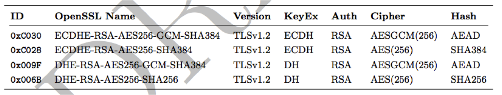

Compatibility:

Only clients which support TLS1.2 are covered by these cipher suites
(Chrome 30, Win 7 and Win 8.1, Opera 17, OpenSSL >= 1.0.1e,
Safari 6/iOS 5, Safari 7/OS X 10.9)
Excellent for controlled environments, like intranet.

## Variant **B**

* weaker ciphers, broad client support

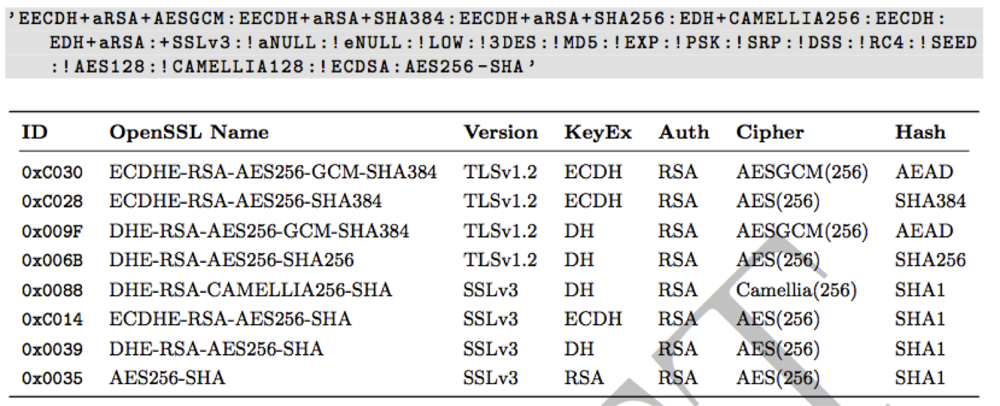

## Example Apache

  * Selecting cipher suites:

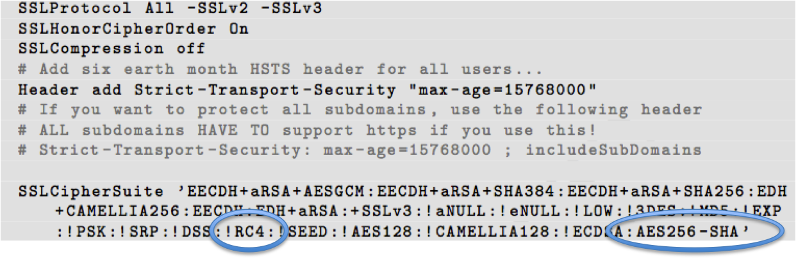

  * Additionally mod\_rewrite:

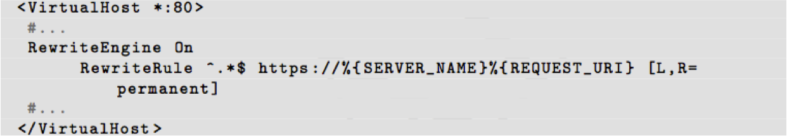

## Testing

## Tools: openssl s_client

   openssl s_client -showcerts –connect git.bettercrypto.org:443

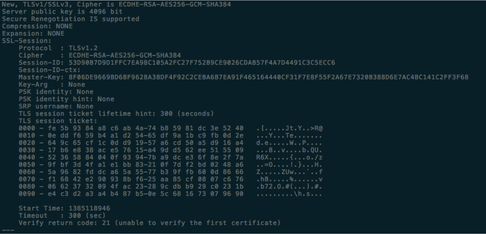

## Tools: sslscan

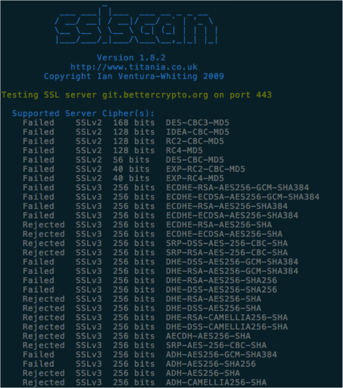

## Tools: ssllabs.com

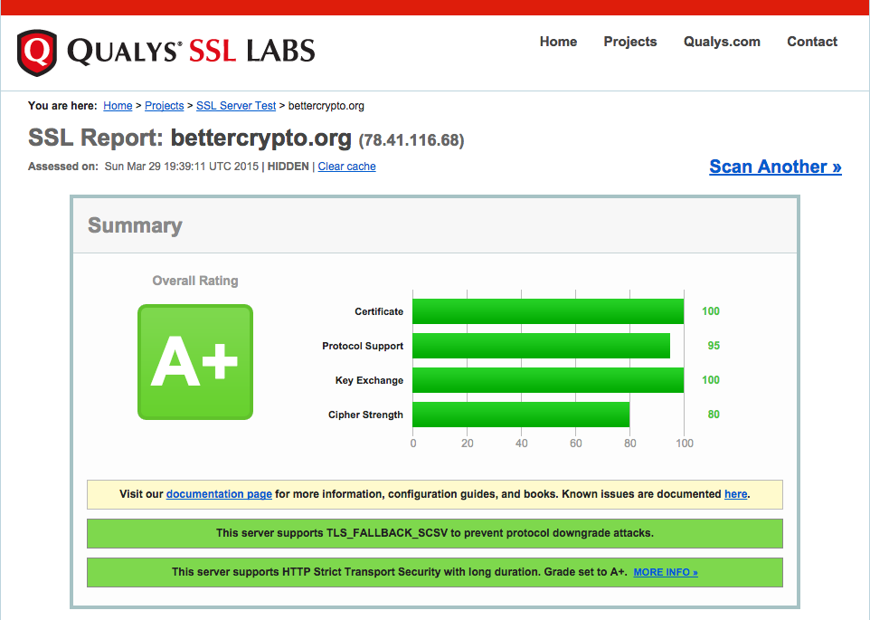

## Tools: ssllabs.com (2)

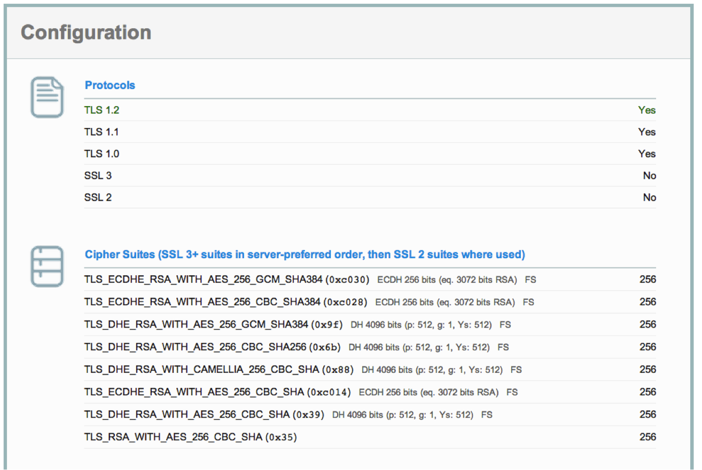

## Tools: ssllabs.com (3)

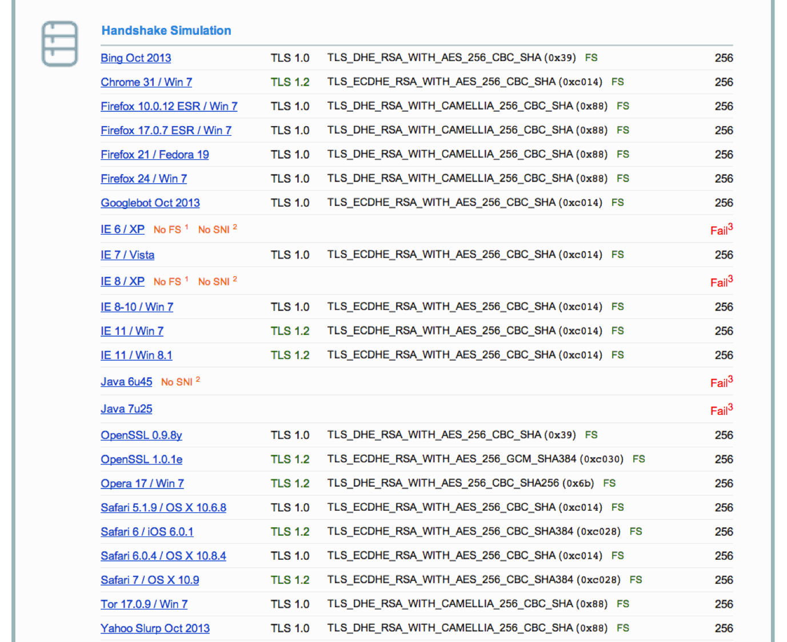

## Tools: SSLyze

[SSLyze](https://github.com/nabla-c0d3/sslyze/releases) is a "Fast and full-featured SSL scanner"

A tool to test internally which cipher strings are supported.
The tool offers these features (amongst others):
  * get a list of targets (ip:port) from a file
  * XML output
  * heartbleed test
  * OCSP stapling test
  * SSLv2-TLS1.2 testing
  * finding preferred and supported cipher strings
  * STARTTLS testing (IMAP, pop, ...)
  * XMPP testing
  * SNI support
  * HSTS testing

## Tools: SSLyze (1)

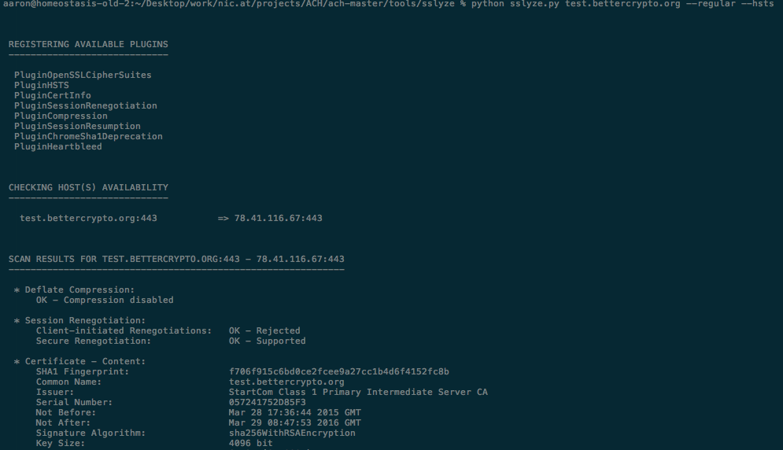

## Tools: SSLyze (2)

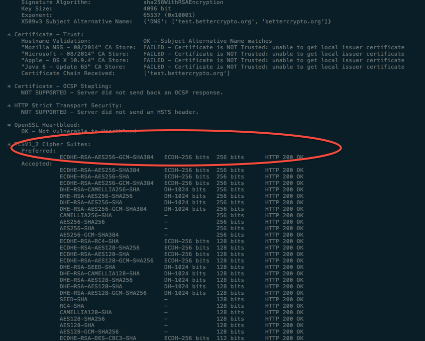

## Mitigated Attacks
We've mitigated some high-profile TLS/SSL vulnerabilities in the past years if you've deployed our guide. So far users have been pleased.

## Mitigated Attacks: CRIME
* Requires TLS compression to perform attack.
* From the very beginning we've always turned off TLS or application level compression (BREACH e.g. is a very similar attack on HTTP compression).

## Mitigated Attacks: POODLE
* Required SSLv3 ("TLS-POODLE" is specific to a certain unfamous vendor).
* We explicitly forbid SSLv3 - this kills the POODLE ;)

## Mitigated Attacks: Logjam
* MITM Attack which requires 512, 768bit Diffie-Hellman to decrypt
* We've always recommended and, if possible, tried to supply a guide how to use DH params with >= 1024 bits
* This was a discussion we had **very** early on in the project and a lot of contributors did their research well
* Some opened tickets, commited etc. - upstream

## Mitigated Attacks: FREAK
* Requires EXPORT (low-security, early-90ties US ammunition export law) ciphers.
* We explicitly exclude EXPORT ciphers, problem solved.

## Mitigated Attacks: DROWN
* Cross-"protocol" (version) attack that requires SSLv2.
* We've **always** recommended against enabling (completely insecure) SSLv2 in all configurations!
* Mail server daemon distributors used to recommend v2 - that's now gone as well.

## Implementation specific attacks
* We can't do a lot against implementation specific attacks
  * there have been quite a lot in the past years (OpenSSL, Apple, Microsoft, $APPLIANCEVENDOR,..)
  * we try to provide a config guide, we're not auditors (up to sec. engineers like you! ;))

## Project statistics
* 45 Contributors (git only) - ML as well (commited by others)
* 1501 commits
* Mostly LateX (a lot of overhead) - no line count stats.
* More than 1200 msgs to the mailing list

## Project statistics (cont.)

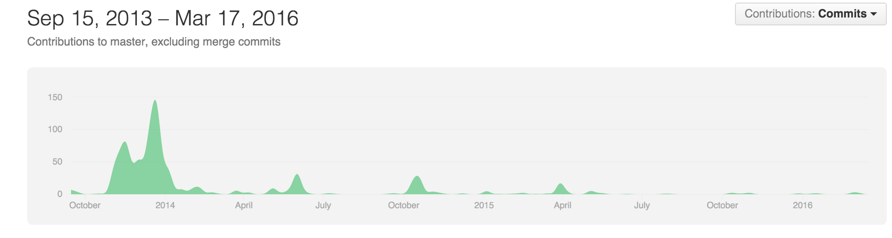

## Project statistics (cont.)

* Always new posts to ML if new attacks appear
* Improvements to the document regularly on GitHub (e.g. Mail, Jabber section)

## Discussion - PostQuantum

* some experts believe that a **real** quantum computer (not D-Wave) is only 10-50 years away
* new 'post-quantum crypto schemes' - no standard yet, we can't use them, almost no implementations
* we currently have no plans to add anything in this direction, but might in the future

## Discussion - ECC

* djb et al: SafeCurves - are NIST/NSA curves trustable? parameters chosen by NSA, might contain backdoor?
* a lot of discussion in the project, we prefered DHE over ECDHE because of uncertainty in 2013
* Nowadays opinion by experts: common implementations are "hardened" and work well (see also: https://eprint.iacr.org/2015/1018.pdf)
* IETF will standardize new non-NIST curves in the near future, implementations will follow as will we.

## Future
* We need continued input by (domain) experts.
* If you know a service, appliance or math well - talk to us, review,..
* This project is still active and needs a bit of upkeep by the community, if you like it, please help out

## Future - testing?
What about automatically testing our configuration recommendations against different distributions, server daemon versions, TLS stacks et cetera? What about automatically deploying them as well?

* Jenkins
* Packer
* Vagrant
* Puppet/Chef/Ansible/CfEngine/..
* ...

## Future - testing?

We'd like to provide a nice JavaScript-y webinterface for choosing your daemon version and getting a proper, up to date, secure configuration for it on the website. There has been interest in the past, but no one working on it currently.

## Status Quo
* Distro and Package security w.r.t. Crypto settings has improved sigificantly over the past years
* Distribution security teams now work on similar issues, as do other secuity teams (e.g. browser vendors)
* There's a lot to do and **tons** of legacy systems with really bad configurations (see ongoing scanning research by various parties)
* IETF works on a lot of protocol and crypto security related improvements - time to market? ;)

## Status Quo (cont.)
* Most sysadmins are still largely unfamiliar with the topic and follow stackexchange, (some-times wrong, unreviewed) blogposts etc.
* We do have quite a few sections and recommendations that need regular checking, love, testing and contribution
* The more people audit, discuss and review, the better the project becomes (if not spammed by crypto-tinfoils)

## Questions?

  * Website: https://www.bettercrypto.org
  * Master (read-only) Git repo: https://git.bettercrypto.org
  * Public github repo for PRs:
    https://github.com/BetterCrypto/Applied-Crypto-Hardening
  * Mailing list: http://lists.cert.at/cgi-bin/mailman/listinfo/ach
  * IRC: #bettercrypto on freenode
  * Twitter: @bettercrypto

