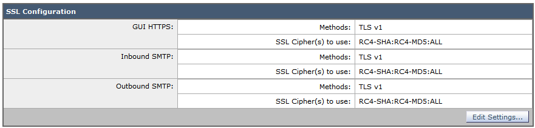
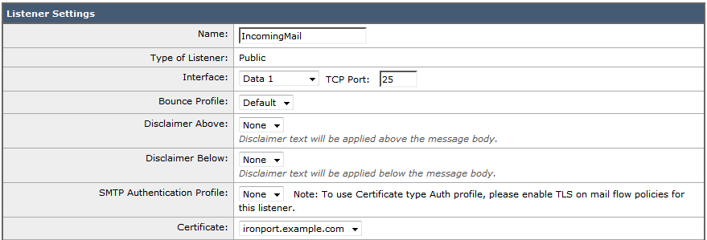
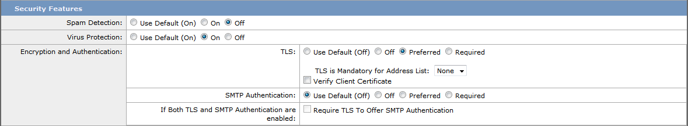
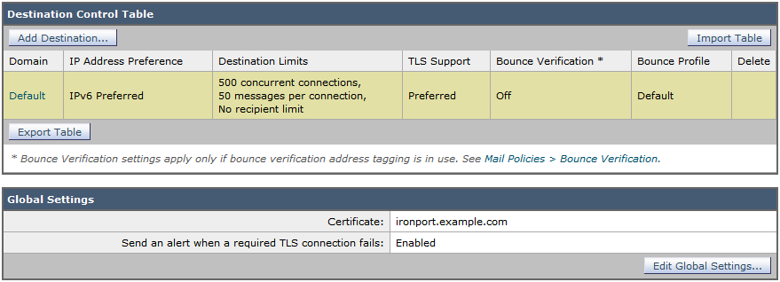

.. role:: math(raw)
   :format: html latex
..

.. role:: raw-latex(raw)
   :format: latex
..

Mail Servers
============

:raw-latex:`\gdef\currentsectionname{MailServers}`
This section documents the most common mail servers. Mail servers may usually
be grouped into three categories:

 * the mail submission agent (MSA)
 * the mail transfer agent (MTA)/mail exchanger (MX)
 * the mail delivery agent (MDA)

An e-mail client (mail user agent, MUA) submits mail to the MSA. This is
usually been done using the Simple Mail Transfer Protocol (SMTP).
Afterwards, the mail is transmitted by the MTA over the Internet to the
MTA of the receiver. This happens again via SMTP. Finally, the mail
client of the receiver will fetch mail from an MDA usually via the
Internet Message Access Protocol (IMAP) or the Post Office Protocol
(POP).

As MSAs and MTAs both use SMTP as transfer protocols, both
functionalities may often be implemented with the same software. On the
other hand, MDA software might or might not implement both IMAP and POP.

TLS usage in mail server protocols
----------------------------------

E-mail protocols support TLS in two different ways. It may be added as a
protocol wrapper on a different port. This method is referred to as
Implicit TLS or as protocol variants SMTPS, IMAPS and POP3S. The other
method is to establish a cleartext session first and switch to TLS
afterwards by issuing the STARTTLS command.

SMTP between MTAs usually makes use of opportunistic TLS. This means
that an MTA will accept TLS connections when asked for it but will not
require it. MTAs should always try opportunistic TLS handshakes outgoing
and always accept incoming opportunistic TLS.

Recommended configuration
-------------------------

We recommend to use the following settings for Mail Transfer Agents:

 *  correctly setup MX, A and PTR RRs without using CNAMEs at all.
 *  the hostname used as HELO/EHLO in outgoing mail shall match the PTR RR
 *  enable opportunistic TLS, using the STARTTLS mechanism on port 25
 *  Implicit TLS on port 465 may be offered additionally
 *  use server and client certificates (most server certificates are client
    certificates as well)
 *  either the common name or at least an alternate subject name of the
    certificate shall match the PTR RR (client mode) or the MX RR (server mode)
 *  do not use self signed certificates
 *  accept all cipher suites, as the alternative would be to fall back to
    cleartext transmission
 * an execption to the last sentence is that MTAs *MUST NOT* enable SSLv2
    protocol support, due to the DROWN
    attack\footnote{\url{https://drownattack.com/drown-attack-paper.pdf}}.

For MSA operation we recommend:

.. raw:: latex

 *  listen on submission port 587 with mandatory STARTTLS
 *  optionally listen on port 465 with Implicit TLS
 *  enforce SMTP AUTH even for local networks
 *  ensure that SMTP AUTH is not allowed on unencrypted connections
 *  only use the recommended cipher suites if all connecting MUAs support them

For MDA operation we recommend:

 *  listen on the protocol port (143 for IMAP, 110 for POP3) with mandatory
    STARTTLS
 *  optionally listen on Implicit TLS ports (993 for IMAPS, 995 for POP3S)
 *  enforce authentication even for local networks
 *  make sure that authentication is not allowed on unencrypted connections
 *  use the recommended cipher suites if all connecting MUAs support them
 *  turn off SSLv2 (DROWN attack\footnote{\url{https://drownattack.com/drown-attack-paper.pdf}})

Dovecot
-------

Tested with Version
~~~~~~~~~~~~~~~~~~~

 *  Dovecot 2.1.7, Debian Wheezy (without: ``ssl\_prefer\_server\_ciphers``)
 *  Dovecot 2.2.9, Debian Jessie
 *  Dovecot 2.2.13, Debian 8.2 Jessie
 *  Dovecot 2.0.19apple1 on OS X Server 10.8.5 (without: ``ssl\_prefer\_server\_ciphers}``)
 *  Dovecot 2.2.9 on Ubuntu 14.04 trusty

Settings
~~~~~~~~

:raw-latex:`\configfile{10-ssl.conf}{48-64}{Dovecot SSL configuration}`

Additional info
~~~~~~~~~~~~~~~

Dovecot 2.0, 2.1: Almost as good as dovecot 2.2. Dovecot does not ignore
unknown configuration parameters. Does not support
ssl\_prefer\_server\_ciphers

Limitations
~~~~~~~~~~~

 * Dovecot < 2.2.14 does not support disabling TLS compression. ≥ 2.2.14 [1]_
   use: ``ssl_options = no_compression``
 * Dovecot < 2.2.7 uses fixed DH parameters. ≥ 2.2.7 [2]_ greater DH-Parameters
   are supported: ``ssl_dh_parameters_length = 2048``.

References
~~~~~~~~~~

 * http://wiki2.dovecot.org/SSL

How to test
~~~~~~~~~~~

::

    openssl s_client -crlf -connect SERVER.TLD:993
    openssl s_client -crlf -connect SERVER.TLD:995
    openssl s_client -crlf -starttls imap -connect SERVER.TLD:143
    openssl s_client -crlf -starttls pop3 -connect SERVER.TLD:110

SSLyze [3]_ offers scanning for common vulnerabilities and displays
Protocols and Cipher-Suites.

::

    sslyze.exe --regular SERVER.TLD:993
    sslyze.exe --regular SERVER.TLD:995
    sslyze.exe --regular --starttls=imap SERVER.TLD:143
    sslyze.exe --regular --starttls=pop3 SERVER.TLD:110

cyrus-imapd
-----------

Tested with Versions
~~~~~~~~~~~~~~~~~~~~

 *  2.4.17

Settings
~~~~~~~~

To activate SSL/TLS configure your certificate with
:raw-latex:`\configfile{imapd.conf}{206-206,209-209}{Activating TLS in cyrus}`

Do not forget to add necessary intermediate certificates to the .pem
file.

Limiting the ciphers provided may force (especially older) clients to
connect without encryption at all! Sticking to the defaults is
recommended.

If you still want to force strong encryption use
:raw-latex:`\configfile{imapd.conf}{263-263}{TLS cipher selection in cyrus}`

cyrus-imapd loads hardcoded 1024 bit DH parameters using
get\_rfc2409\_prime\_1024() by default. If you want to load your own DH
parameters add them PEM encoded to the certificate file given in
tls\_cert\_file. Do not forget to re-add them after updating your
certificate.

To prevent unencrypted connections on the STARTTLS ports you can set
:raw-latex:`\configfile{imapd.conf}{131-131}{Force encrypted connections in cyrus}`
This way MUAs can only authenticate with plain text authentication
schemes after issuing the STARTTLS command. Providing CRAM-MD5 or
DIGEST-MD5 methods is not recommended.

To support POP3/IMAP on ports 110/143 with STARTTLS and POP3S/IMAPS on
ports 995/993 check the SERVICES section in ``cyrus.conf``
:raw-latex:`\configfile{cyrus.conf}{28-28,31-34,71-71}{STARTTLS for POP3/IMAP and POP3S/IMAPS in cyrus}`

Limitations
~~~~~~~~~~~

cyrus-imapd currently (2.4.17, trunk) does not support `elliptic curve`
cryptography. Hence, ECDHE will not work even if defined in your cipher
list.

Currently there is no way to prefer server ciphers or to disable
compression.

There is a working patch for all three features:
https://bugzilla.cyrusimap.org/show_bug.cgi?id=3823

How to test
~~~~~~~~~~~

::

    openssl s_client -crlf -connect SERVER.TLD:993

Postfix
-------

Tested with Versions
~~~~~~~~~~~~~~~~~~~~

 *  Postfix 2.9.6, Debian Wheezy with OpenSSL 1.0.1e
 *  Postfix 2.11.0 on Ubuntu 14.04.02 with OpenSSL 1.0.1f

Settings
~~~~~~~~

Postfix has five internal lists of ciphers, and the possibility to
switch between those with *smtpd\_tls\_ciphers*. However, we leave this
at its default value for server to server connections, as many mail
servers only support outdated protocols and ciphers. We consider bad
encryption still better than plain text transmission. For connections to
MUAs, TLS is mandatory and the ciphersuite is modified.

MX and SMTP client configuration:
^^^^^^^^^^^^^^^^^^^^^^^^^^^^^^^^^

As discussed in section :ref:`subsection-smtp_general`,
because of opportunistic encryption we do not restrict the list of
ciphers or protocols for communication with other mail servers to avoid
transmission in plain text. There are still some steps needed to enable
TLS, all in ``main.cf``:

:raw-latex:`\configfile{main.cf}{20-31}{Opportunistic TLS in Postfix}`

MSA:
^^^^

For the MSA ``smtpd`` process which communicates with mail clients, we
first define the ciphers that are acceptable for the “mandatory”
security level, again in ``main.cf``:

:raw-latex:`\configfile{main.cf}{34-44}{MSA TLS configuration in Postfix}`

Then, we configure the MSA smtpd in ``master.cf`` with two additional
options that are only used for this instance of smtpd:

:raw-latex:`\configfile{master.cf}{12-14}{MSA smtpd service configuration in Postfix}`

For those users who want to use EECDH key exchange, it is possible to
customize this via:
:raw-latex:`\configfile{main.cf}{45-45}{EECDH customization in Postfix}`
The default value since Postfix 2.8 is “strong”.

Limitations
~~~~~~~~~~~

tls\_ssl\_options is supported from Postfix 2.11 onwards. You can leave
the statement in the configuration for older versions, it will be
ignored.

tls\_preempt\_cipherlist is supported from Postfix 2.8 onwards. Again,
you can leave the statement in for older versions.

References
~~~~~~~~~~

Refer to http://www.postfix.org/TLS_README.html for an in-depth
discussion.

Additional settings
~~~~~~~~~~~~~~~~~~~

Postfix has two sets of built-in DH parameters that can be overridden
with the ``smtpd_tls_dh512_param_file`` and
``smtpd_tls_dh1024_param_file`` options. The “dh512” parameters are used
for export ciphers, while the “dh1024” ones are used for all other
ciphers.

The “bit length” in those parameter names is just a name, so one could
use stronger parameter sets; it should be possible to e.g. use the IKE
Group14 parameters (see section :ref:`section-DH`) without
much interoperability risk, but we have not tested this yet.

How to test
~~~~~~~~~~~

You can check the effect of the settings with the following command:

::

    $ zegrep "TLS connection established from.*with cipher" /var/log/mail.log | awk '{printf("%s %s %s %s\n", $12, $13, $14, $15)}' | sort | uniq -c | sort -n
          1 SSLv3 with cipher DHE-RSA-AES256-SHA
         23 TLSv1.2 with cipher DHE-RSA-AES256-GCM-SHA384
         60 TLSv1 with cipher ECDHE-RSA-AES256-SHA
        270 TLSv1.2 with cipher ECDHE-RSA-AES256-GCM-SHA384
        335 TLSv1 with cipher DHE-RSA-AES256-SHA

::

    openssl s_client -starttls smtp -crlf -connect SERVER.TLD:25

Exim
----

Tested with Versions
~~~~~~~~~~~~~~~~~~~~

 *  Exim 4.82, Debian Jessie
 *  Exim 4.82, Ubuntu 14.04.2 with OpenSSL 1.0.1e

It is highly recommended to read
http://exim.org/exim-html-current/doc/html/spec_html/ch-encrypted_smtp_connections_using_tlsssl.html
first.

MSA mode (submission):
^^^^^^^^^^^^^^^^^^^^^^

In the main config section of Exim add:
:raw-latex:`\configfile{configure.msa}{153-154}{Certificate selection in Exim (MSA)}`
Don’t forget to add intermediate certificates to the .pem file if
needed.

Tell Exim to advertise STARTTLS in the EHLO answer to everyone:
:raw-latex:`\configfile{configure.msa}{145-145}{TLS advertise in Exim (MSA)}`

If you want to support legacy SMTPS on port 465, and STARTTLS on
smtp(25)/submission(587) ports set
:raw-latex:`\configfile{configure.msa}{165-166}{STARTTLS and SMTPS in Exim (MSA)}`

It is highly recommended to limit SMTP AUTH to SSL connections only. To
do so add
:raw-latex:`\configfile{configure.msa}{813-813}{SSL-only authentication in Exim (MSA)}`
to every authenticator defined.

Add the following rules on top of your acl\_smtp\_mail:
:raw-latex:`\configfile{configure.msa}{111-111,501-505}{Submission mode in Exim (MSA)}`
This switches Exim to submission mode and allows addition of missing
“Message-ID” and “Date” headers.

It is not advisable to restrict the default cipher list for MSA mode if
you don’t know all connecting MUAs. If you still want to define one
please consult the Exim documentation or ask on the exim-users
mailinglist. The cipher used is written to the logfiles by default. You
may want to add

::

    log_selector = <whatever your log_selector already contains> +tls_certificate_verified +tls_peerdn +tls_sni

to get even more TLS information logged.

Server mode (incoming):
^^^^^^^^^^^^^^^^^^^^^^^

In the main config section of Exim add:
:raw-latex:`\configfile{configure.server}{152-153}{Certificate selection in Exim (Server)}`
don’t forget to add intermediate certificates to the .pem file if
needed.

Tell Exim to advertise STARTTLS in the EHLO answer to everyone:
:raw-latex:`\configfile{configure.server}{144-144}{TLS advertise in Exim (Server)}`

Listen on smtp(25) port only
:raw-latex:`\configfile{configure.server}{166-166}{STARTTLS on SMTP in Exim (Server)}`

It is not advisable to restrict the default cipher list for
opportunistic encryption as used by SMTP. Do not use cipher lists
recommended for HTTPS! If you still want to define one please consult
the Exim documentation or ask on the exim-users mailinglist. If you want
to request and verify client certificates from sending hosts set
:raw-latex:`\configfile{configure.server}{154-155}{TLS certificate verifiaction in Exim (Server)}`

tls\_try\_verify\_hosts only reports the result to your logfile. If you
want to disconnect such clients you have to use

::

    tls_verify_hosts = *

The cipher used is written to the logfiles by default. You may want to
add

::

    log_selector = <whatever your log_selector already contains> +tls_certificate_verified +tls_peerdn +tls_sni

to get even more TLS information logged.

Client mode (outgoing):
^^^^^^^^^^^^^^^^^^^^^^^

Exim uses opportunistic encryption in the SMTP transport by default.

Client mode settings have to be done in the configuration section of the
smtp transport (driver = smtp).

If you want to use a client certificate (most server certificates can be
used as client certificate, too) set
:raw-latex:`\configfile{configure.client}{152-153}{Certificate selection in Exim (Client)}`
This is recommended for MTA-MTA traffic.

Do not limit ciphers without a very good reason. In the worst case you
end up without encryption at all instead of some weak encryption. Please
consult the Exim documentation if you really need to define ciphers.

OpenSSL:
^^^^^^^^

Exim already disables SSLv2 by default. We recommend to add

::

    openssl_options = +all +no_sslv2 +no_sslv3 +no_compression +cipher_server_preference

to the main configuration.

Note: +all is misleading here since OpenSSL only activates the most
common workarounds. But that’s how SSL\_OP\_ALL is defined.

You do not need to set dh\_parameters. Exim with OpenSSL by default uses
parameter initialization with the “2048-bit MODP Group with 224-bit
Prime Order Subgroup” defined in section 2.2 of RFC 5114 :cite:`rfc5114` (ike23). If you want to set your own DH
parameters please read the TLS documentation of exim.

GnuTLS:
^^^^^^^

GnuTLS is different in only some respects to OpenSSL:

 *  tls\_require\_ciphers needs a GnuTLS priority string instead of a cipher list. It is recommended to use the defaults by not defining this option. It highly depends on the version of GnuTLS used. Therefore it is not advisable to change the defaults.
 *  There is no option like openssl\_options

Exim string expansion:
^^^^^^^^^^^^^^^^^^^^^^

Note that most of the options accept expansion strings. This way you can
e.g. set cipher lists or STARTTLS advertisement conditionally. Please
follow the link to the official Exim documentation to get more
information.

Limitations:
~~~~~~~~~~~~

Exim currently (4.82) does not support `elliptic curve`s with OpenSSL.
This means that ECDHE is not used even if defined in your cipher list.
There already is a working patch to provide support:
http://bugs.exim.org/show_bug.cgi?id=1397

How to test
~~~~~~~~~~~

::

    openssl s_client -starttls smtp -crlf -connect SERVER.TLD:25

Cisco ESA/IronPort
------------------

Tested with Version
~~~~~~~~~~~~~~~~~~~

 *  AsyncOS 7.6.1
 *  AsyncOS 8.5.6
 *  AsyncOS 9.0.0, 9.5.0, 9.6.0, 9.7.0

Settings
~~~~~~~~

Import your certificate(s) using the WEBUI (Network -> Certificates).

From AsyncOS 9.0 and up, SSL parameters for inbound SMTP, outbound SMTP and GUI
access can be configured in one step via the WEBUI (System Administration ->
SSL Configuration, see figure :ref:`fig-ach_ironport_ssl_settings`
on page :raw-latex:`\pageref{fig:ach_ironport_ssl_settings}`).

For all versions prior to 9.0, you have to connect to the CLI and configure the
SSL parameters separately, as shown below using inbound SMTP as example.

::

    ironport.example.com> sslconfig
    sslconfig settings:
      GUI HTTPS method:  sslv3tlsv1
      GUI HTTPS ciphers: RC4-SHA:RC4-MD5:ALL
      Inbound SMTP method:  sslv3tlsv1
      Inbound SMTP ciphers: RC4-SHA:RC4-MD5:ALL
      Outbound SMTP method:  sslv3tlsv1
      Outbound SMTP ciphers: RC4-SHA:RC4-MD5:ALL
    	
    Choose the operation you want to perform:
    - GUI - Edit GUI HTTPS ssl settings.
    - INBOUND - Edit Inbound SMTP ssl settings.
    - OUTBOUND - Edit Outbound SMTP ssl settings.
    - VERIFY - Verify and show ssl cipher list.
    []> inbound

    Enter the inbound SMTP ssl method you want to use.
    1. SSL v2.
    2. SSL v3
    3. TLS v1
    4. SSL v2 and v3
    5. SSL v3 and TLS v1
    6. SSL v2, v3 and TLS v1
    [5]> 3

    Enter the inbound SMTP ssl cipher you want to use.
    [RC4-SHA:RC4-MD5:ALL]> EDH+CAMELLIA:EDH+aRSA:EECDH+aRSA+AESGCM:EECDH+aRSA+SHA256:EECDH:+CAMELLIA128:+AES128:+SSLv3:!aNULL:!eNULL:!LOW:!3DES:!MD5:!EXP:!PSK:!DSS:!RC4:!SEED:!IDEA:!ECDSA:kEDH:CAMELLIA128-SHA:AES128-SHA

    sslconfig settings:
      GUI HTTPS method:  sslv3tlsv1
      GUI HTTPS ciphers: RC4-SHA:RC4-MD5:ALL
      Inbound SMTP method:  tlsv1
      Inbound SMTP ciphers: EDH+CAMELLIA:EDH+aRSA:EECDH+aRSA+AESGCM:EECDH+aRSA+SHA384:EECDH+aRSA+SHA256:EECDH:+CAMELLIA256:+AES256:+CAMELLIA128:+AES128:+SSLv3:!aNULL:!eNULL:!LOW:!3DES:!MD5:!EXP:!PSK:!SRP:!DSS:!RC4:!SEED:!ECDSA:CAMELLIA256-SHA:AES256-SHA:CAMELLIA128-SHA:AES128-SHA
      Outbound SMTP method:  sslv3tlsv1
      Outbound SMTP ciphers: RC4-SHA:RC4-MD5:ALL

Note that starting with AsyncOS 9.0 SSLv3 is disabled by default,
whereas the default cipher set is still ``RC4-SHA:RC4-MD5:ALL`` (see
figure :ref:`fig-ach_ironport_ssl_settings` on page
:raw-latex:`\pageref{fig:ach_ironport_ssl_settings}`).

|Default SSL Settings|

After committing these changes in the CLI, you have to activate the use
of TLS in several locations.

For inbound connections, first select the appropriate certificate in the
settings of each listener you want to have TLS enabled on (Network ->
Listeners, see figure :ref:`fig-ach_ironport_listener_cert` on page
:raw-latex:`\pageref{fig:ach_ironport_listener_cert}`). Afterwards, for each
listener, configure all Mail Flow Policies which have their Connection Behavior
set to “Accept” or “Relay” to at least prefer TLS (Mail Policies -> Mail Flow
Policies, see figure :ref:`fig-ach_ironport_mail_flow_tls` on page
:raw-latex:`\pageref{fig:ach_ironport_mail_flow_tls}`).

It is recommended to also enable TLS in the default Mail Flow Policy, because
these settings will be inherited by newly created policies, unless specifically
overwritten.

TLS can be enforced by creating a new Mail Flow Policy with TLS
set to “required”, creating a new Sender Group defining the addresses of the
sending mail servers for which you want to enforce encryption (Mail Policies ->
HAT Overview) and using this new Sender Group in conjunction with the newly
created Mail Flow Policy.

|Listener Settings|

|Mail Flow Policy Security Features|

TLS settings for outbound connections have to be configured within the
Destination Controls (Mail Policies -> Destination Controls). Choose the
appropriate SSL certificate within the global settings and configure TLS
to be preferred in the default profile to enable it for all outbound
connections. After these two steps the Destination Control overview page
should look like figure :ref:`fig-ach_ironport_dest_control`
on page :raw-latex:`\pageref{fig:ach_ironport_dest_control}`. To enforce
TLS for a specific destination domain, add an entry to the Destination
Control Table and set “TLS Support” to “required”.

|Destination Control overview|

Limitations
~~~~~~~~~~~

All AsyncOS releases prior to version 9.5 use OpenSSL 0.9.8. Therefore
TLS 1.2 is not supported in these versions and some of the suggested
ciphers won’t work. Starting with AsyncOS 9.5 TLS 1.2 is fully
supported. [4]_ You can check the supported ciphers on the CLI by using
the option ``verify`` from within the ``sslconfig`` command:

::

   []> verify

    Enter the ssl cipher you want to verify.
    []> EDH+CAMELLIA:EDH+aRSA:EECDH+aRSA+AESGCM:EECDH+aRSA+SHA256:EECDH:+CAMELLIA128:+AES128:+SSLv3:!aNULL:!eNULL:!LOW:!3DES:!MD5:!EXP:!PSK:!DSS:!RC4:!SEED:!IDEA:!ECDSA:kEDH:CAMELLIA128-SHA:AES128-SHA

    DHE-RSA-CAMELLIA256-SHA SSLv3 Kx=DH       Au=RSA  Enc=Camellia(256) Mac=SHA1
    DHE-RSA-CAMELLIA128-SHA SSLv3 Kx=DH       Au=RSA  Enc=Camellia(128) Mac=SHA1
    DHE-RSA-AES256-SHA      SSLv3 Kx=DH       Au=RSA  Enc=AES(256)  Mac=SHA1
    DHE-RSA-AES128-SHA      SSLv3 Kx=DH       Au=RSA  Enc=AES(128)  Mac=SHA1
    CAMELLIA128-SHA         SSLv3 Kx=RSA      Au=RSA  Enc=Camellia(128) Mac=SHA1
    AES128-SHA              SSLv3 Kx=RSA      Au=RSA  Enc=AES(128)  Mac=SHA1

How to test
~~~~~~~~~~~

::

    openssl s_client -starttls smtp -crlf -connect SERVER.TLD:25

.. [1]
   http://www.dovecot.org/doc/NEWS-2.2

.. [2]
   http://hg.dovecot.org/dovecot-2.2/rev/43ab5abeb8f0

.. [3]
   https://github.com/nabla-c0d3/sslyze/releases

.. [4]
   http://www.cisco.com/c/dam/en/us/td/docs/security/esa/esa9-5/ESA_9-5_Release_Notes.pdf,
   Changed Behaviour, page 4

