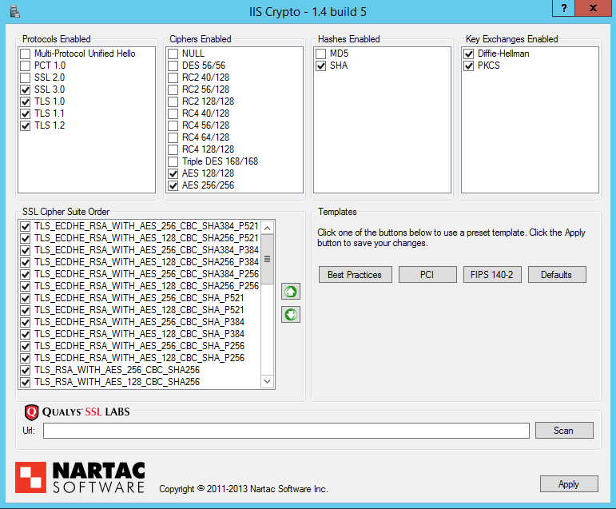

Webservers
==========

Apache
------

Note that any cipher suite starting with EECDH can be omitted, if in
doubt. (Compared to the theory section, EECDH in Apache and ECDHE in
OpenSSL are synonyms  [1]_)

Tested with Versions
~~~~~~~~~~~~~~~~~~~~

Apache 2.2.22 linked against OpenSSL 1.0.1e, Debian Wheezy

Apache 2.4.6 linked against OpenSSL 1.0.1e, Debian Jessie

Settings
~~~~~~~~

Enabled modules *SSL* and *Headers* are required.

Additional settings
~~~~~~~~~~~~~~~~~~~

You might want to redirect everything to *https://* if possible. In
Apache you can do this with the following setting inside of a
VirtualHost environment:

References
~~~~~~~~~~

Apache2 Docs on SSL and TLS: https://httpd.apache.org/docs/2.4/ssl/

How to test
~~~~~~~~~~~

See appendix [cha:tools]

lighttpd
--------

Tested with Versions
~~~~~~~~~~~~~~~~~~~~

lighttpd/1.4.31-4 with OpenSSL 1.0.1e on Debian Wheezy

lighttpd/1.4.33 with OpenSSL 0.9.8o on Debian Squeeze (note that TLSv1.2
does not work in openssl 0.9.8 thus not all ciphers actually work)

lighttpd/1.4.28-2 with OpenSSL 0.9.8o on Debian Squeeze (note that
TLSv1.2 does not work in openssl 0.9.8 thus not all ciphers actually
work)

Settings
~~~~~~~~

Starting with lighttpd version 1.4.29 Diffie-Hellman and Elliptic-Curve
Diffie-Hellman key agreement protocols are supported. By default,
elliptic curve “prime256v1” (also “secp256r1”) will be used, if no other
is given. To select special curves, it is possible to set them using the
configuration options ``ssl.dh-file`` and ``ssl.ec-curve``.

Please read section [section:DH] for more information on Diffie Hellman
key exchange and elliptic curves.

Additional settings
~~~~~~~~~~~~~~~~~~~

As for any other webserver, you might want to automatically redirect
*http://* traffic toward *https://*. It is also recommended to set the
environment variable *HTTPS*, so the PHP applications run by the
webserver can easily detect that HTTPS is in use.

Additional information
~~~~~~~~~~~~~~~~~~~~~~

The config option *honor-cipher-order* is available since 1.4.30, the
supported ciphers depend on the used OpenSSL-version (at runtime). ECDHE
has to be available in OpenSSL at compile-time, which should be default.
SSL compression should by deactivated by default at compile-time (if
not, it’s active).

Support for other SSL-libraries like GnuTLS will be available in the
upcoming 2.x branch, which is currently under development.

References
~~~~~~~~~~

HTTPS redirection:
http://redmine.lighttpd.net/projects/1/wiki/HowToRedirectHttpToHttps

Lighttpd Docs SSL:
http://redmine.lighttpd.net/projects/lighttpd/wiki/Docs_SSL

Release 1.4.30 (How to mitigate BEAST attack)
http://redmine.lighttpd.net/projects/lighttpd/wiki/Release-1_4_30

SSL Compression disabled by default:
http://redmine.lighttpd.net/issues/2445

How to test
~~~~~~~~~~~

See appendix [cha:tools]

nginx
-----

Tested with Version
~~~~~~~~~~~~~~~~~~~

1.4.4 with OpenSSL 1.0.1e on OS X Server 10.8.5

1.2.1-2.2+wheezy2 with OpenSSL 1.0.1e on Debian Wheezy

1.4.4 with OpenSSL 1.0.1e on Debian Wheezy

1.2.1-2.2 bpo60+2 with OpenSSL 0.9.8o on Debian Squeeze (note that
TLSv1.2 does not work in openssl 0.9.8 thus not all ciphers actually
work)

Settings
~~~~~~~~

If you absolutely want to specify your own DH parameters, you can
specify them via

::

    ssl_dhparam file;

However, we advise you to read section [section:DH] and stay with the
standard IKE/IETF parameters (as long as they are >1024 bits).

Additional settings
~~~~~~~~~~~~~~~~~~~

If you decide to trust NIST’s ECC curve recommendation, you can add the
following line to nginx’s configuration file to select special curves:

You might want to redirect everything to *https://* if possible. In
Nginx you can do this with the following setting:

References
~~~~~~~~~~

http://nginx.org/en/docs/http/ngx_http_ssl_module.html

http://wiki.nginx.org/HttpSslModule

How to test
~~~~~~~~~~~

See appendix [cha:tools]

MS IIS
------

To configure SSL/TLS on Windows Server IIS Crypto can be used.  [2]_
Simply start the Programm, no installation required. The tool changes
the registry keys described below. A restart ist required for the
changes to take effect.

   IIS Crypto Tool

[fig:IISCryptoConfig]

Instead of using the IIS Crypto Tool the configuration can be set using
the Windows Registry. The following Registry keys apply to the newer
Versions of Windows (Windows 7, Windows Server 2008, Windows Server 2008
R2, Windows Server 2012 and Windows Server 2012 R2). For detailed
information about the older versions see the Microsoft knowledgebase
article.  [3]_

::

      [HKEY_LOCAL_MACHINE\SYSTEM\CurrentControlSet\Control\SecurityProviders\Schannel] 
      [HKEY_LOCAL_MACHINE\SYSTEM\CurrentControlSet\Control\SecurityProviders\Schannel\Ciphers] 
      [HKEY_LOCAL_MACHINE\SYSTEM\CurrentControlSet\Control\SecurityProviders\Schannel\CipherSuites] 
      [HKEY_LOCAL_MACHINE\SYSTEM\CurrentControlSet\Control\SecurityProviders\Schannel\Hashes] 
      [HKEY_LOCAL_MACHINE\SYSTEM\CurrentControlSet\Control\SecurityProviders\Schannel\KeyExchangeAlgorithms] 
      [HKEY_LOCAL_MACHINE\SYSTEM\CurrentControlSet\Control\SecurityProviders\Schannel\Protocols] 

Tested with Version
~~~~~~~~~~~~~~~~~~~

Windows Server 2008

Windows Server 2008 R2

Windows Server 2012

Windows Server 2012 R2

Windows Vista and Internet Explorer 7 and upwards

Windows 7 and Internet Explorer 8 and upwards

Windows 8 and Internet Explorer 10 and upwards

Windows 8.1 and Internet Explorer 11

Settings
~~~~~~~~

When trying to avoid RC4 (RC4 biases) as well as CBC (BEAST-Attack) by
using GCM and to support perfect forward secrecy, Microsoft SChannel
(SSL/TLS, Auth,.. Stack) supports ECDSA but lacks support for RSA
signatures (see ECC suite B doubts [4]_).

Since one is stuck with ECDSA, an elliptic curve certificate needs to be
used.

The configuration of cipher suites MS IIS will use, can be configured in
one of the following ways:

#. Group Policy  [5]_

#. Registry  [6]_

#. IIS Crypto  [7]_

#. Powershell

Table [tab:MS\ :sub:`I`\ IS\ :sub:`C`\ lient\ :sub:`S`\ upport] shows
the process of turning on one algorithm after another and the effect on
the supported clients tested using https://www.ssllabs.com.

``SSL 3.0``, ``SSL 2.0`` and ``MD5`` are turned off. ``TLS 1.0`` and
``TLS 2.0`` are turned on.

Table [tab:MS\ :sub:`I`\ IS\ :sub:`C`\ lient\ :sub:`S`\ upport] shows
the algorithms from strongest to weakest and why they need to be added
in this order. For example insisting on SHA-2 algorithms (only first two
lines) would eliminate all versions of Firefox, so the last line is
needed to support this browser, but should be placed at the bottom, so
capable browsers will choose the stronger SHA-2 algorithms.

``TLS_RSA_WITH_RC4_128_SHA`` or equivalent should also be added if MS
Terminal Server Connection is used (make sure to use this only in a
trusted environment). This suite will not be used for SSL, since we do
not use a RSA Key.

Clients not supported:

#. Java 6

#. WinXP

#. Bing

Additional settings
~~~~~~~~~~~~~~~~~~~

It’s recommended to use Strict-Transport-Security: max-age=15768000 for
detailed information visit the  [8]_ Microsoft knowledgebase.

You might want to redirect everything to http\ **s**:// if possible. In
IIS you can do this with the following setting by Powershell:

::

    Set-WebConfiguration -Location "$WebSiteName/$WebApplicationName" `
        -Filter 'system.webserver/security/access' `
        -Value "SslRequireCert"

Justification for special settings (if needed)
~~~~~~~~~~~~~~~~~~~~~~~~~~~~~~~~~~~~~~~~~~~~~~

References
~~~~~~~~~~

http://support.microsoft.com/kb/245030/en-us

http://support.microsoft.com/kb/187498/en-us

How to test
~~~~~~~~~~~

See appendix [cha:tools]

Supporting older clients
------------------------

Older clients like Internet Explorer on Windows XP (actually the Windows
XP crypto stack), Java 6 and Java 7 aren’t supported by the recommended
Variant B cipher string. To catch most of those old clients you might
use their inability to understand SNI to create a catchall page with a
default SSL server. On the default page you should provide information
about upgrading their browser to the user. This will not work with Java
7 because Java 7 understands SNI.

Apache
~~~~~~

Create a default SSL server:

The catchall virtual server needs to be the first server in the config.
You also should not use snakeoil certificates (as in the snipplet above)
but the very same certificate as you use for the real service. In case
you provide several virtual servers via SNI, the certificate for the
catchall page needs to include all their names.

nginx
~~~~~

Create a default SSL server:

The real service then needs to be in its own server definition omitting
the ``default`` keyword in the ``listen`` directive. You should not use
snakeoil certificates (as in the snipplet above) but the very same
certificate as you use for the real service. In case you provide several
virtual servers via SNI, the certificate for the catchall page needs to
include all their names.

.. [1]
   https://www.mail-archive.com/openssl-dev@openssl.org/msg33405.html

.. [2]
   https://www.nartac.com/Products/IISCrypto/

.. [3]
   http://support.microsoft.com/kb/245030/en-us

.. [4]
   http://safecurves.cr.yp.to/rigid.html

.. [5]
   http://msdn.microsoft.com/en-us/library/windows/desktop/bb870930(v=vs.85).aspx

.. [6]
   `http://support.microsoft.com/kb/245030  <http://support.microsoft.com/kb/245030 >`__

.. [7]
   https://www.nartac.com/Products/IISCrypto/

.. [8]
   http://www.iis.net/configreference/system.webserver/httpprotocol/customheaders
