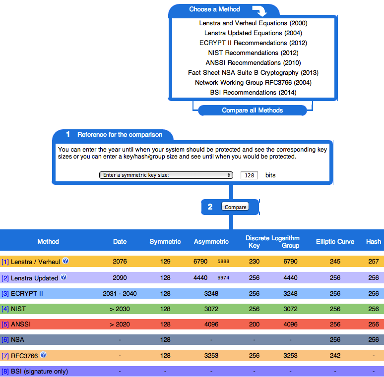

.. role:: raw-latex(raw)
   :format: latex
..

Keylengths
==========

.. epigraph::

   “On the choice between AES256 and AES128: I would never consider using
   AES256, just like I don't wear a helmet when I sit inside my car. It's too
   much bother for the epsilon improvement in security.”

   -- Vincent Rijmen in a personal mail exchange Dec 2013

Recommendations on keylengths need to be adapted regularly. Since this
document first of all is static and second of all, does not consider
itself to be authoritative on keylengths, we would rather refer to
existing publications and websites. Recommending a safe key length is a
hit-and-miss issue.

Furthermore, when choosing an encryption algorithm and key length, the
designer/sysadmin always needs to consider the value of the information
and how long it must be protected. In other words: consider the number
of years the data needs to stay confidential.

The ECRYPT II publication :cite:`ii2011ecrypt` gives a
fascinating overview of strengths of symmetric keys in chapter 5 and
chapter 7. Summarizing ECRYPT II, we recommend 128 bit of key strength
for symmetric keys. In ECRYPT II, this is considered safe for security
level 7, long term protection.

In the same ECRYPT II publication you can find a practical comparison of
key size equivalence between symmetric key sizes and RSA, discrete log
(DLOG) and EC keylengths. ECRYPT II arrives at the interesting
conclusion that for an equivalence of 128 bit symmetric size, you will
need to use an 3248 bit RSA
key :raw-latex:`\cite[chapter 7, page 30]{ii2011ecrypt}`.

There are a couple of other studies comparing keylengths and their
respective strengths. The website http://www.keylength.com/ compares
these papers and offers a good overview of approximations for key
lengths based on recommendations by different standardization bodies and
academic publications. Figure :ref:`fig-keylengths.com`
shows a typical comparison of keylengths on this web site.

|Screenshot of http://www.keylength.com for 128
bit symmetric key size equivalents|

Summary
-------

.. raw:: latex

   \begin{itemize}
     \item For asymmetric public-key cryptography we consider any key length below
   3248 bits to be deprecated at the time of this writing (for long term
   protection).
     \item For elliptic curve cryptography we consider key lengths below 256 bits to
   be inadequate for long term protection.  
     \item For symmetric algorithms we consider anything below 128 bits to be
   inadequate for long term protection.
   \end{itemize}

Special remark on 3DES:
-----------------------

We want to note that 3DES theoretically has 168 bits of security,
however based on the NIST Special Publication 800-57  [1]_, it is clear
that 3DES can only be considered to provide for 80 bits / 112 bits
security.

.. [1]
   http://csrc.nist.gov/publications/PubsSPs.html#800-57-part1, pages 63
   and 64

